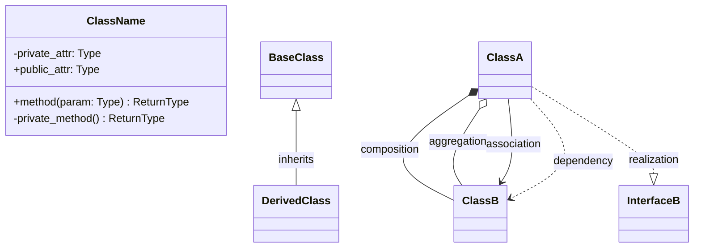
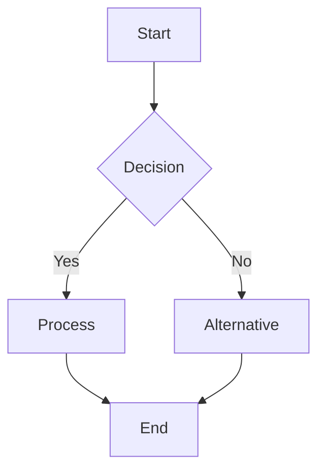
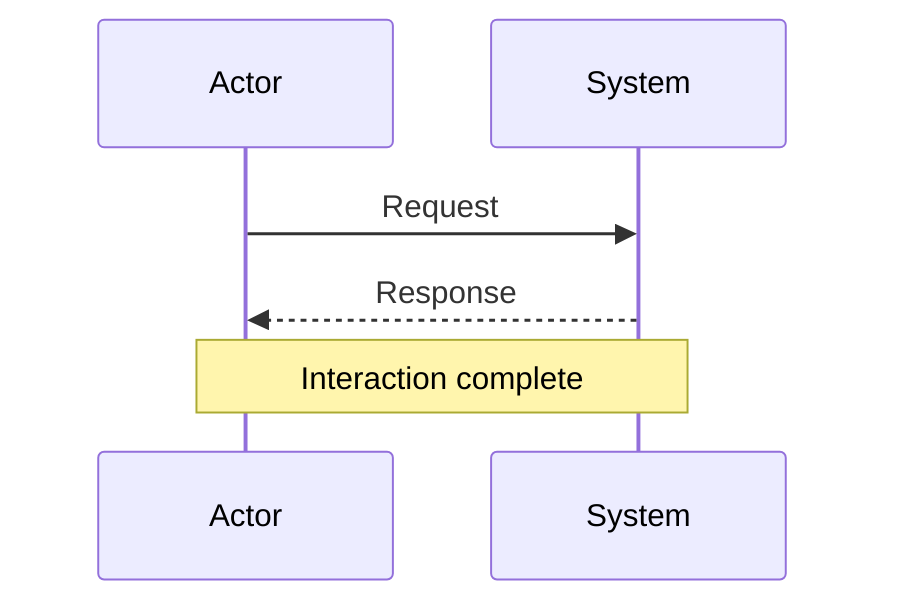

# Maintaining Mermaid Architecture Diagrams

This guide helps keep the architecture diagrams current as the codebase evolves.

## Overview

The architecture documentation uses Mermaid diagrams located in:
- `/docs/architecture/` - High-level diagrams
- `/docs/architecture/class_diagrams/` - Detailed class diagrams

## When to Update Diagrams

Update diagrams when you:
1. Add new modules or classes
2. Change class relationships (inheritance, composition)
3. Modify data flow patterns
4. Add new external dependencies
5. Implement new design patterns
6. Change database schema

## Diagram Types and Update Guidelines

### 1. Context Diagram (`context_diagram.md`)
**Update when:**
- Adding new external data sources
- Integrating new Python libraries
- Creating major new components
- Changing high-level data flow

**Example update:**
```mermaid
%% Add new external service
subgraph "External Services"
    API[Health API<br/>Remote Data]
end
API --> DL
```

### 2. Module Overview (`module_overview.md`)
**Update when:**
- Creating new Python modules
- Changing module dependencies
- Adding new module functions
- Implementing new patterns

**Example update:**
```mermaid
%% Add new module
NEWMOD[new_module.py<br/>New Feature]
NEWMOD --> DB
MW --> NEWMOD
```

### 3. Core Classes (`core_classes.md`)
**Update when:**
- Adding new DAO classes
- Modifying DatabaseManager
- Changing data loader functionality
- Adding new methods to existing classes

**Example update:**
```mermaid
class NewDAO {
    +method1() ReturnType
    +method2(param: Type) ReturnType
}
BaseDAO <|-- NewDAO : implements
```

### 4. Data Models (`data_models.md`)
**Update when:**
- Creating new model classes
- Adding fields to existing models
- Changing database schema
- Modifying relationships

**Example update:**
```mermaid
class NewModel {
    +str field1
    +int field2
    +to_dict() Dict
    +from_dict(data: Dict) NewModel
}
BaseModel <|.. NewModel : implements
```

### 5. Service Layer (`service_layer.md`)
**Update when:**
- Adding new UI components
- Creating new service classes
- Implementing new managers
- Changing signal/slot connections

**Example update:**
```mermaid
class NewService {
    -dependency: Type
    +service_method() Result
}
MainWindow *-- NewService : uses
```

## Update Process

### 1. Identify Changed Components
```bash
# Find recently modified files
git diff --name-only HEAD~1

# Check for new classes
grep -r "^class " src/ --include="*.py"
```

### 2. Update Relevant Diagrams
1. Open the appropriate `.md` file
2. Locate the mermaid code block
3. Add/modify diagram elements
4. Update relationships

### 3. Validate Diagrams
1. Preview in a Mermaid-compatible viewer
2. Check for syntax errors
3. Ensure relationships are correct
4. Verify styling is consistent

### 4. Update Documentation
1. Add explanatory text if needed
2. Update the component overview sections
3. Keep examples current

## Common Mermaid Syntax

### Class Diagrams


### Flowcharts


### Sequence Diagrams


## Style Guidelines

### Colors
Use consistent color schemes:
```mermaid
classDef external fill:#f9f,stroke:#333,stroke-width:2px
classDef data fill:#bbf,stroke:#333,stroke-width:2px
classDef ui fill:#bfb,stroke:#333,stroke-width:2px
classDef util fill:#fbb,stroke:#333,stroke-width:2px
```

### Naming
- Use descriptive node labels
- Include file names where relevant
- Add brief descriptions in nodes

### Layout
- Group related components
- Use subgraphs for logical grouping
- Maintain consistent flow direction

## Automated Checks

Consider adding these checks to your workflow:

```python
# Check for undocumented classes
import ast
import os

def find_undocumented_classes():
    """Find classes not in architecture diagrams"""
    # Parse Python files for class definitions
    # Compare with classes in mermaid diagrams
    # Report missing classes
    pass
```

## Quick Commands

### Add a new class to diagram:
1. Find the class definition
2. Identify its base class and dependencies
3. Add to appropriate diagram
4. Update relationships

### Update module dependencies:
1. Run `grep -r "^import\|^from" src/module.py`
2. Update module overview diagram
3. Add new dependency arrows

### Document a new pattern:
1. Identify where pattern is used
2. Add to appropriate diagram
3. Update patterns section in README

## Resources

- [Mermaid Documentation](https://mermaid.js.org/)
- [Mermaid Live Editor](https://mermaid.live/)
- [VS Code Mermaid Extension](https://marketplace.visualstudio.com/items?itemName=bierner.markdown-mermaid)

Remember: Keep diagrams as simple as possible while conveying essential information. Focus on clarity over completeness.