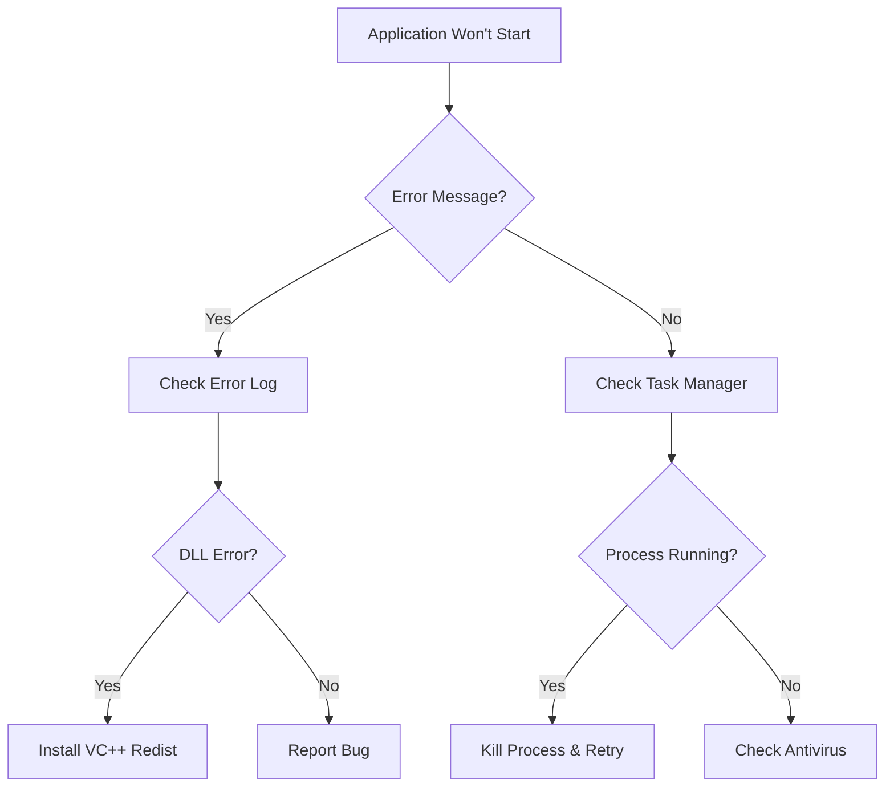

# Task: Create Installation Troubleshooting Guide

## Description
Develop a comprehensive troubleshooting guide specifically focused on installation and runtime issues users might encounter with the packaged Windows executable. This guide should cover common problems, their solutions, and provide clear steps for users to resolve issues independently.

## Goal / Objectives
- Document common installation problems and solutions
- Create diagnostic steps for runtime issues
- Provide antivirus false positive resolution steps
- Include system requirement verification
- Offer clear, step-by-step solutions
- Create both user-facing and support documentation

## Related Documentation
- ADR-003: Security and antivirus considerations
- Windows deployment documentation
- Error handling implementation in the codebase

## Acceptance Criteria
- [ ] Guide covers all common installation issues
- [ ] Antivirus false positive section is comprehensive
- [ ] System requirement checks are documented
- [ ] Solutions are tested and verified to work
- [ ] Diagnostic steps help identify root causes
- [ ] Guide includes visual aids where helpful
- [ ] Support contact information is provided
- [ ] FAQ section addresses common concerns

## Subtasks
- [ ] Identify common installation failure scenarios
- [ ] Document antivirus whitelist procedures
- [ ] Create system requirement verification steps
- [ ] Write runtime error troubleshooting section
- [ ] Document data import issues and solutions
- [ ] Create performance troubleshooting guide
- [ ] Add logging and diagnostic collection steps
- [ ] Include rollback and reinstallation procedures
- [ ] Create visual troubleshooting flowcharts

## Implementation Guidance

### Troubleshooting Guide Structure
```
Troubleshooting Guide
├── 1. Before You Begin
│   ├── System Requirements Check
│   ├── Downloading the Correct Version
│   └── Preparing for Installation
├── 2. Installation Issues
│   ├── "Windows protected your PC" message
│   ├── Antivirus blocking installation
│   ├── Missing dependencies (.NET, VC++)
│   ├── Insufficient permissions
│   └── Corrupted download
├── 3. Runtime Issues
│   ├── Application won't start
│   ├── Crashes on startup
│   ├── Slow performance
│   ├── UI rendering problems
│   └── Memory issues
├── 4. Data Import Problems
│   ├── "Invalid XML" errors
│   ├── Import taking too long
│   ├── Missing data after import
│   └── Database errors
├── 5. Feature-Specific Issues
│   ├── Charts not displaying
│   ├── Journal save failures
│   ├── Export not working
│   └── Update check failures
├── 6. Diagnostic Tools
│   ├── Enabling debug logging
│   ├── Collecting system information
│   ├── Running in safe mode
│   └── Creating diagnostic report
└── 7. Getting Additional Help
    ├── Community forums
    ├── Bug reporting
    └── Direct support
```

### Common Issues and Solutions

#### Windows SmartScreen Warning
```markdown
## "Windows protected your PC" Message

### Why this happens:
Windows SmartScreen warns about new or uncommonly downloaded software.

### Solution:
1. Click "More info"
2. Click "Run anyway"
3. The application is safe - we're working on code signing certification

### Alternative:
Disable SmartScreen temporarily:
1. Windows Security > App & browser control
2. Change settings under "Check apps and files"
```

#### Antivirus False Positives
```markdown
## Antivirus Blocking Installation

### Common antivirus solutions:

#### Windows Defender
1. Open Windows Security
2. Go to "Virus & threat protection"
3. Click "Protection history"
4. Find the blocked item
5. Click "Actions" > "Allow"

#### Norton/Symantec
1. Open Norton
2. Go to "Security" > "History"
3. Find quarantined file
4. Select "Restore & Exclude"

#### McAfee
1. Open McAfee
2. Go to "Quarantined items"
3. Select the file
4. Click "Restore"
```

### System Requirements Verification
```batch
@echo off
echo Checking system requirements...
echo.

:: Check Windows version
for /f "tokens=4-5 delims=. " %%i in ('ver') do set VERSION=%%i.%%j
echo Windows Version: %VERSION%

:: Check .NET Framework
reg query "HKLM\SOFTWARE\Microsoft\NET Framework Setup\NDP\v4\Full" /v Release >nul 2>&1
if %errorlevel% == 0 (
    echo .NET Framework 4.0+: Installed
) else (
    echo .NET Framework 4.0+: NOT FOUND - Please install
)

:: Check available disk space
for /f "tokens=3" %%a in ('dir c:\ ^| find "free"') do set FREE_SPACE=%%a
echo Free disk space: %FREE_SPACE%

pause
```

### Diagnostic Information Collection
```python
# Add to application for diagnostic report
def generate_diagnostic_report():
    """Generate diagnostic information for troubleshooting."""
    report = {
        "app_version": get_version(),
        "python_version": sys.version,
        "qt_version": QtCore.QT_VERSION_STR,
        "platform": platform.platform(),
        "cpu_count": os.cpu_count(),
        "memory_available": psutil.virtual_memory().available,
        "disk_free": shutil.disk_usage(".").free,
        "data_dir": get_data_directory(),
        "log_tail": get_last_log_lines(100)
    }
    return report
```

### Performance Troubleshooting
```markdown
## Application Running Slowly

### Quick fixes:
1. **Close other applications** - Free up system resources
2. **Check disk space** - Ensure >1GB free
3. **Disable animations** - Settings > Performance > Disable animations
4. **Reduce data range** - Filter to recent data only

### Advanced solutions:
1. **Clear cache**
   - Navigate to Settings > Advanced
   - Click "Clear Cache"
   
2. **Optimize database**
   - Settings > Maintenance
   - Click "Optimize Database"
   
3. **Reinstall fresh**
   - Export journal entries first
   - Uninstall application
   - Delete AppData folder
   - Reinstall latest version
```

### Visual Troubleshooting Flowchart


### FAQ Section
```markdown
## Frequently Asked Questions

### Q: Is my health data secure?
A: Yes! All data stays on your computer. No cloud upload.

### Q: Can I move the app to another computer?
A: Yes, use the portable version or export/import your data.

### Q: Why is my antivirus flagging the app?
A: New executables often trigger false positives. The app is safe.

### Q: How do I completely uninstall?
A: Use Windows uninstaller, then delete %APPDATA%\AppleHealthMonitor
```

## Output Log
*(This section is populated as work progresses on the task)*

[YYYY-MM-DD HH:MM:SS] Task created
