# Apple Health Monitor Dashboard - Architecture Documentation

This directory contains comprehensive architecture documentation for the Apple Health Monitor Dashboard, including system diagrams, class relationships, design patterns, and detailed implementation guides.

## 🏗️ Architecture Overview

The Apple Health Monitor Dashboard is a sophisticated PyQt6-based desktop application designed for comprehensive Apple Health data analysis and visualization. It implements a robust layered architecture with clear separation of concerns, extensive caching strategies, and modern UI patterns.

### Key Features
- **150+ Python modules** across all layers
- **3-tier caching system** for optimal performance  
- **WSJ-inspired UI design** with professional styling
- **Comprehensive analytics engine** with health scoring
- **Real-time data processing** with background workers
- **Local-first approach** for privacy and security

## 📊 Architecture Diagrams

### 1. [System Context Diagram](./context_diagram.md)
**Complete system overview showing:**
- High-level component interactions
- External system integrations (Apple Health XML, CSV imports)
- Technology stack context
- Primary data flow patterns
- Security and privacy architecture

### 2. [Module Relationship Overview](./module_overview.md)
**Comprehensive module analysis including:**
- 150+ module dependencies and relationships
- Analytics engine architecture (38+ modules)
- UI layer organization (85+ modules)
- Core infrastructure components
- Performance optimization patterns

### 3. Detailed Class Diagrams

#### [Core Infrastructure Classes](./class_diagrams/core_classes.md)
**Foundation layer components:**
- DatabaseManager (Thread-safe singleton with connection pooling)
- Data Access Objects (7 specialized DAOs with caching)
- XML streaming processor for large file handling
- Statistics calculator with advanced analytics
- Configuration management and error handling

#### [Data Models & Domain Objects](./class_diagrams/data_models.md)
**Rich domain model with 12+ dataclasses:**
- Journal system with mood tracking and keyword extraction
- Health scoring models with personalized recommendations
- Caching models with compression and performance metrics
- Import tracking with deduplication and statistics
- User preferences with type-safe storage

#### [Service Layer & UI Architecture](./class_diagrams/service_layer.md)
**Complete service coordination:**
- Main window with tab-based navigation
- Dashboard widgets (Daily, Weekly, Monthly)
- Analytics service layer with calculator hierarchy
- Background processing with worker threads
- Notification and achievement systems

## 🎯 Key Architectural Patterns

### 1. **Layered Architecture**
```
┌─────────────────────────────────────────────────────┐
│  🎨 Presentation Layer (85+ modules)                │
│     • MainWindow with tab-based navigation          │
│     • Dashboard widgets (Daily/Weekly/Monthly)      │
│     • Chart components with WSJ styling             │
│     • Custom UI controls and dialogs               │
├─────────────────────────────────────────────────────┤
│  ⚙️ Service Layer (Cross-cutting concerns)           │
│     • StyleManager (WSJ theme system)              │
│     • ComponentFactory (UI consistency)            │
│     • NotificationManager (achievements)           │
│     • PersonalRecordsTracker (gamification)        │
├─────────────────────────────────────────────────────┤
│  📊 Analytics Engine (38+ modules)                  │
│     • Calculator hierarchy (Daily→Weekly→Monthly)   │
│     • Health scoring with personalization          │
│     • Anomaly detection and trend analysis         │
│     • Comparative analytics and insights           │
├─────────────────────────────────────────────────────┤
│  💾 Data Access Layer (7 DAOs + Caching)           │
│     • DAO pattern with specialized classes         │
│     • 3-tier caching (Memory→SQLite→Disk)         │
│     • Query optimization and bulk operations       │
│     • Filter engine with complex criteria          │
├─────────────────────────────────────────────────────┤
│  🗄️ Persistence Layer                               │
│     • SQLite with WAL mode and migrations         │
│     • 12+ dataclasses with rich domain behavior   │
│     • XML streaming processor for large files     │
│     • Backup and data validation systems          │
└─────────────────────────────────────────────────────┘
```

### 2. **Core Design Patterns**

| Pattern | Implementation | Purpose | Location |
|---------|---------------|---------|----------|
| **Singleton** | DatabaseManager, StyleManager | Single instances for critical resources | Core infrastructure |
| **DAO** | 7 specialized data access objects | Clean data layer abstraction | Data access layer |
| **Factory** | ComponentFactory, ChartFactory | Consistent object creation | Service layer |
| **Observer** | PyQt signals/slots throughout | Event-driven architecture | All layers |
| **Strategy** | Multiple calculator/analysis strategies | Pluggable algorithms | Analytics engine |
| **Template Method** | BaseDashboardWidget hierarchy | Consistent workflow patterns | UI layer |
| **Protocol** | DataSourceProtocol, ChartProtocol | Interface-based design | Cross-cutting |
| **Context Manager** | Database connections, caching | Resource safety | Infrastructure |

### 3. **Technology Stack & Dependencies**

```mermaid
graph TB
    subgraph "🖥️ Desktop Application"
        APP[Apple Health Monitor Dashboard]
    end
    
    subgraph "🎨 UI Framework" 
        PYQT6[PyQt6 - Modern Desktop UI]
        MPL[Matplotlib - Chart Rendering]
        ACCESSIBILITY[WCAG 2.1 AA Support]
    end
    
    subgraph "📊 Data & Analytics"
        PANDAS[Pandas - Data Analysis] 
        NUMPY[NumPy - Numerical Computing]
        STATSMODELS[Statsmodels - Statistics]
        SKLEARN[Scikit-learn - ML Analytics]
    end
    
    subgraph "💾 Storage & Performance"
        SQLITE[SQLite - Local Database]
        CACHING[Multi-tier Caching System]
        COMPRESSION[Data Compression]
    end
    
    subgraph "🛠️ Development & Quality"
        PYTEST[PyTest - Testing Framework]
        SPHINX[Sphinx - Documentation]
        RUFF[Ruff - Code Quality]
        MYPY[MyPy - Type Checking]
    end
    
    APP --> PYQT6
    APP --> PANDAS
    APP --> SQLITE
    
    PYQT6 --> MPL
    PYQT6 --> ACCESSIBILITY
    
    PANDAS --> NUMPY
    PANDAS --> STATSMODELS
    PANDAS --> SKLEARN
    
    SQLITE --> CACHING
    CACHING --> COMPRESSION
    
    %% Development dependencies
    APP -.-> PYTEST
    APP -.-> SPHINX
    APP -.-> RUFF
    APP -.-> MYPY
    
    %% Styling
    style APP fill:#4caf50,color:#fff
    style PYQT6 fill:#2196f3,color:#fff  
    style PANDAS fill:#ff9800,color:#fff
    style SQLITE fill:#9c27b0,color:#fff
```



### 4. **Performance Architecture**

- **3-Tier Caching**: Memory (LRU) → SQLite → Compressed disk storage
- **Background Processing**: Non-blocking UI with QThread workers
- **Streaming Data**: Large XML files processed in batches
- **Connection Pooling**: Database connections managed efficiently
- **Lazy Loading**: UI components and data loaded on demand

## 🧭 Quick Navigation Guide

### For New Developers
1. **Start here**: [System Context Diagram](./context_diagram.md) - Overall system understanding
2. **Then read**: [Module Overview](./module_overview.md) - Module relationships and dependencies
3. **Deep dive**: Choose your area of interest below

### By Development Area

| Area | Primary Documentation | Key Patterns |
|------|----------------------|--------------|
| **🔧 Core Infrastructure** | [Core Classes](./class_diagrams/core_classes.md) | Singleton, DAO, Context Manager |
| **📊 Data Processing** | [Data Models](./class_diagrams/data_models.md) | Domain Model, Factory, Validation |
| **🎨 UI Development** | [Service Layer](./class_diagrams/service_layer.md) | Observer, Factory, Template Method |
| **⚡ Performance** | [Module Overview](./module_overview.md) | Strategy, Caching, Background Processing |
| **🏗️ Architecture** | [Context Diagram](./context_diagram.md) | Layered, Protocol-based, Local-first |

### Common Tasks
- **Adding new charts**: Review Chart Factory patterns in [Service Layer](./class_diagrams/service_layer.md)
- **Database changes**: Check migration patterns in [Core Classes](./class_diagrams/core_classes.md)
- **New analytics**: Study calculator hierarchy in [Module Overview](./module_overview.md)
- **UI modifications**: Understand component factory in [Service Layer](./class_diagrams/service_layer.md)

## 📈 Metrics & Scale

- **📁 Total Modules**: 150+ Python files across all packages
- **🏗️ Core Infrastructure**: 16 modules (database, models, config)
- **📊 Analytics Engine**: 38+ modules (calculators, scoring, caching)
- **🎨 UI Layer**: 85+ modules (widgets, charts, dashboards)
- **🛠️ Utilities**: 3 modules (error handling, logging, validation)
- **🧪 Test Coverage**: Comprehensive unit, integration, and performance tests

## 🔄 Maintaining Architecture Documentation

### When to Update
- **New major features**: Update relevant class diagrams
- **Architecture changes**: Revise context or module diagrams  
- **New patterns**: Document in appropriate sections
- **Performance optimizations**: Update caching or processing flows

### Update Process
1. **Identify affected diagrams** from your changes
2. **Update mermaid code** in relevant .md files
3. **Test diagram rendering** to ensure validity
4. **Update this README** if adding new concepts
5. **Review cross-references** between documents

### Tools & Commands
- Use `.claude/commands/simone/mermaid.md` for diagram maintenance guidance
- Mermaid Live Editor for testing: https://mermaid.live/
- VS Code Mermaid extensions for local preview

## 🎯 Design Philosophy

### Core Principles
1. **Local-First**: All health data remains on user's machine
2. **Performance**: 3-tier caching and background processing
3. **Maintainability**: Clear patterns and comprehensive documentation
4. **User Experience**: WSJ-inspired design with smooth interactions
5. **Extensibility**: Protocol-based design enables easy feature addition
6. **Reliability**: Comprehensive error handling and data validation