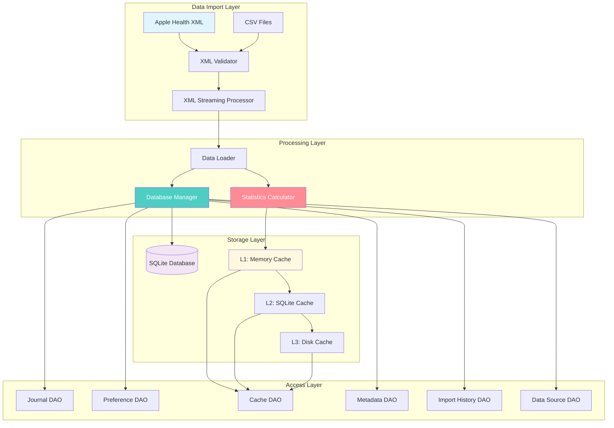
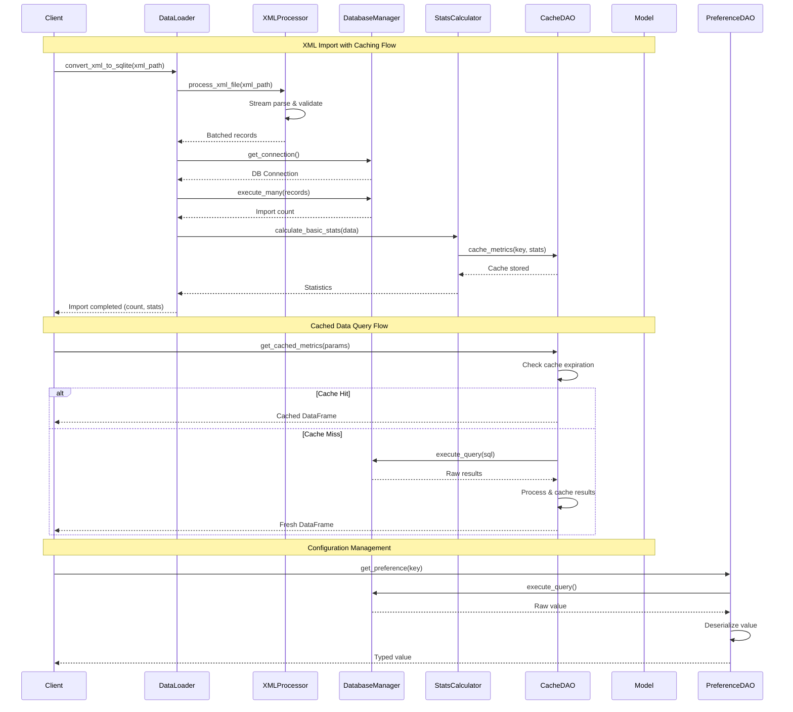
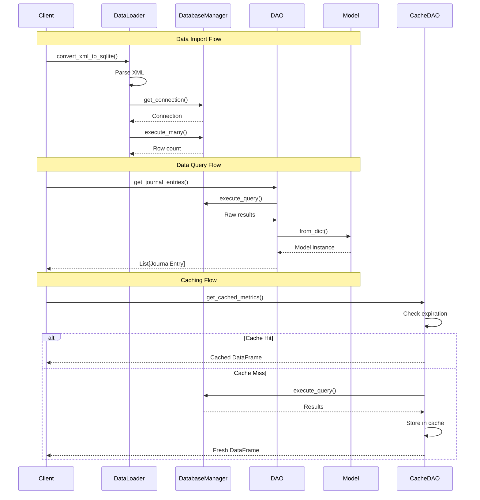

# Apple Health Monitor Dashboard - Core Infrastructure Classes

This diagram shows the core data processing classes, their relationships, and key infrastructure components that form the foundation of the application.

## Core Infrastructure Overview

```mermaid
classDiagram
    %% Database Management Layer
    class DatabaseManager {
        <<Singleton>>
        -str db_path
        -bool initialized  
        -DatabaseManager _instance
        -Lock _lock
        -dict _connection_pool
        +__new__(db_path: str) DatabaseManager
        +get_connection() Iterator~Connection~
        +initialize_database() void
        +execute_query(query: str, params: tuple) List
        +execute_command(command: str, params: tuple) int
        +execute_many(command: str, params_list: List) int
        +table_exists(table_name: str) bool
        +get_schema_version() int
        +backup_database(backup_path: str) bool
        -_ensure_database_exists() void
        -_apply_migrations(conn: Connection) void
        -_setup_wal_mode(conn: Connection) void
    }

    %% Data Import and Processing
    class DataLoader {
        -Logger logger
        -str db_path
        -DatabaseManager db_manager
        -XMLStreamingProcessor processor
        +__init__(db_path: str)
        +convert_xml_to_sqlite(xml_path: str) int
        +convert_xml_to_sqlite_with_validation(xml_path: str) Tuple
        +load_csv(csv_path: str) DataFrame
        +get_all_records() DataFrame
        +query_date_range(start: date, end: date, types: List) DataFrame
        +get_daily_summary(types: List) DataFrame  
        +get_weekly_summary(types: List) DataFrame
        +get_monthly_summary(types: List) DataFrame
        +get_available_types() List[str]
        +get_date_range() Tuple[date, date]
        +validate_database() Tuple[bool, str]
        -_infer_source_name(record_type: str) str
        -_batch_insert_records(records: List) int
    }

    class XMLStreamingProcessor {
        -int batch_size
        -Logger logger
        +__init__(batch_size: int)
        +process_xml_file(xml_path: str, callback: Callable) Iterator
        +validate_xml_structure(xml_path: str) bool
        -_parse_health_record(element: Element) Dict
        -_extract_metadata(element: Element) Dict
    }

    %% DAO Layer Base
    class BaseDAO {
        <<abstract>>
        #DatabaseManager db_manager
        #Logger logger
        #str table_name
        +__init__() void
        +get_connection() Iterator~Connection~
        +execute_query(query: str, params: tuple) List
        +execute_command(query: str, params: tuple) int
        #_validate_params(params: Dict) bool
        #_handle_db_error(error: Exception) void
    }

    %% Core DAOs
    class JournalDAO {
        +save_journal_entry(entry: JournalEntry) int
        +get_journal_entries(entry_type: str, limit: int) List~JournalEntry~
        +get_entries_by_date_range(start: date, end: date) List~JournalEntry~
        +search_journal_entries(search_term: str) List~JournalEntry~
        +delete_journal_entry(entry_id: int) bool
        +update_journal_entry(entry: JournalEntry) bool
        +get_entry_statistics() Dict
    }

    class PreferenceDAO {
        +get_preference(key: str, default: Any) Any
        +set_preference(key: str, value: Any, data_type: str) void
        +get_all_preferences() Dict[str, Any]
        +delete_preference(key: str) bool
        +reset_to_defaults() void
        +export_preferences() Dict
        +import_preferences(prefs: Dict) bool
        -_serialize_value(value: Any) str
        -_deserialize_value(value: str, data_type: str) Any
    }

    class CacheDAO {
        +cache_metrics(key_params: Dict, data: DataFrame, expires_in: int) void
        +get_cached_metrics(key_params: Dict) Optional~DataFrame~
        +invalidate_cache(pattern: str) int
        +clean_expired_cache() int
        +get_cache_statistics() Dict
        +warm_cache(key_params: Dict, data: DataFrame) void
        -_generate_cache_key(params: Dict) str
        -_compress_data(data: DataFrame) bytes
        -_decompress_data(data: bytes) DataFrame
    }

    class MetricsMetadataDAO {
        +get_metric_metadata(metric_type: str) Optional~HealthMetricsMetadata~
        +update_metric_metadata(metadata: HealthMetricsMetadata) void
        +get_metrics_by_category(category: str) List~HealthMetricsMetadata~
        +get_all_metric_types() List[str]
        +register_custom_metric(metadata: HealthMetricsMetadata) void
        +delete_metric_metadata(metric_type: str) bool
    }

    class DataSourceDAO {
        +register_data_source(source: DataSource) void
        +get_active_sources() List~DataSource~
        +get_source_by_name(name: str) Optional~DataSource~
        +update_source_activity(source_name: str, last_active: datetime) void
        +get_source_statistics() Dict
        +deactivate_source(source_name: str) void
    }

    class ImportHistoryDAO {
        +record_import(history: ImportHistory) int
        +get_import_history(limit: int) List~ImportHistory~
        +get_import_by_hash(file_hash: str) Optional~ImportHistory~
        +is_file_imported(file_hash: str) bool
        +get_import_statistics() Dict
        +cleanup_old_imports(days: int) int
    }

    %% Statistics and Analytics Foundation
    class StatisticsCalculator {
        -CacheDAO cache_dao
        -Logger logger
        +__init__()
        +calculate_basic_stats(data: DataFrame) StatisticsResult
        +calculate_trend_analysis(data: DataFrame, period: str) TrendResult
        +calculate_percentiles(data: DataFrame, percentiles: List) Dict
        +calculate_correlation_matrix(data: DataFrame) DataFrame
        +calculate_moving_averages(data: DataFrame, windows: List) DataFrame
        +detect_outliers(data: DataFrame, method: str) List[int]
        +calculate_z_scores(data: DataFrame) DataFrame
        -_validate_data(data: DataFrame) bool
        -_cache_calculation(key: str, result: Any) void
    }

    %% Configuration Management
    class ConfigManager {
        <<Singleton>>
        -Dict config_data
        -str config_path
        +__init__(config_path: str)
        +get_config(key: str, default: Any) Any
        +set_config(key: str, value: Any) void
        +save_config() bool
        +load_config() bool
        +reset_config() void
        +validate_config() Tuple[bool, List[str]]
        -_ensure_config_exists() void
    }

    %% Relationships
    DatabaseManager <|.. DataLoader : uses
    DatabaseManager <|.. BaseDAO : uses
    DataLoader *-- XMLStreamingProcessor : contains
    
    BaseDAO <|-- JournalDAO : extends
    BaseDAO <|-- PreferenceDAO : extends  
    BaseDAO <|-- CacheDAO : extends
    BaseDAO <|-- MetricsMetadataDAO : extends
    BaseDAO <|-- DataSourceDAO : extends
    BaseDAO <|-- ImportHistoryDAO : extends
    
    StatisticsCalculator --> CacheDAO : uses
    StatisticsCalculator --> DatabaseManager : uses
    
    DataLoader --> StatisticsCalculator : creates
    
    %% Configuration relationships
    ConfigManager <.. DatabaseManager : configures
    ConfigManager <.. DataLoader : configures

    %% Notes
    note for DatabaseManager "Thread-safe singleton with connection pooling\nSupports WAL mode and automatic migrations"
    note for BaseDAO "Abstract base providing common DAO functionality\nError handling and logging built-in"
    note for CacheDAO "3-tier caching: Memory + SQLite + Compressed\nAutomatic expiration and cache warming"
    note for XMLStreamingProcessor "Handles large XML files efficiently\nBatch processing for memory optimization"
```



## Data Processing Pipeline



## Core Class Interactions



## Class Interactions



## Key Design Patterns

### 1. Singleton Pattern
The `DatabaseManager` and `ConfigManager` use thread-safe singleton pattern:

```python
class DatabaseManager:
    _instance = None
    _lock = threading.Lock()
    
    def __new__(cls, db_path=None):
        if not cls._instance:
            with cls._lock:
                if not cls._instance:
                    cls._instance = super().__new__(cls)
                    cls._instance.initialized = False
        return cls._instance
```

**Benefits:**
- Single point of database access
- Connection pooling and resource management
- Thread-safe initialization

### 2. Context Manager Pattern
Database connections are managed using context managers for resource safety:

```python
@contextmanager
def get_connection(self):
    conn = sqlite3.connect(self.db_path, timeout=30.0)
    conn.execute("PRAGMA journal_mode=WAL")
    try:
        yield conn
        conn.commit()
    except Exception:
        conn.rollback()
        raise
    finally:
        conn.close()
```

**Benefits:**
- Automatic resource cleanup
- Transaction management
- Exception safety

### 3. Data Access Object (DAO) Pattern
Each entity type has a dedicated DAO that encapsulates database operations:

```python
class JournalDAO(BaseDAO):
    def __init__(self):
        super().__init__()
        self.table_name = "journal_entries"
        
    def save_journal_entry(self, entry: JournalEntry) -> int:
        with self.get_connection() as conn:
            cursor = conn.execute(
                self._get_insert_query(),
                entry.to_dict()
            )
            return cursor.lastrowid
```

**Benefits:**
- Clean separation of data access logic
- Consistent error handling
- Built-in caching integration

### 4. Factory Pattern
Model classes provide factory methods for object creation:

```python
@classmethod
def from_dict(cls, data: Dict[str, Any]) -> 'JournalEntry':
    """Factory method to create instance from dictionary."""
    return cls(
        entry_type=data['entry_type'],
        content=data['content'],
        created_at=datetime.fromisoformat(data['created_at'])
    )
```

**Benefits:**
- Flexible object creation
- Input validation
- Type safety

### 5. Template Method Pattern
BaseDAO provides template methods for common operations:

```python
class BaseDAO:
    def execute_query(self, query: str, params: tuple = ()) -> List:
        """Template method for executing queries."""
        try:
            self._validate_params(params)
            with self.get_connection() as conn:
                return self._execute_and_fetch(conn, query, params)
        except Exception as e:
            self._handle_db_error(e)
            raise
```

**Benefits:**
- Consistent error handling
- Standardized logging
- Uniform parameter validation

### 6. Strategy Pattern
Different caching strategies can be plugged in:

```python
class CacheDAO:
    def __init__(self, strategy: CacheStrategy = "tiered"):
        self.strategy = self._get_cache_strategy(strategy)
    
    def cache_metrics(self, key: str, data: DataFrame):
        return self.strategy.cache(key, data)
```

**Benefits:**
- Flexible caching approaches
- Performance optimization
- Runtime strategy switching

## Performance Optimizations

### 1. Connection Pooling
```python
class DatabaseManager:
    def __init__(self):
        self._connection_pool = queue.Queue(maxsize=10)
        self._setup_connection_pool()
```

### 2. Batch Processing
```python
def _batch_insert_records(self, records: List[Dict]) -> int:
    """Process records in batches for better performance."""
    batch_size = 1000
    total_inserted = 0
    
    for i in range(0, len(records), batch_size):
        batch = records[i:i + batch_size]
        total_inserted += self._insert_batch(batch)
    
    return total_inserted
```

### 3. Lazy Loading
```python
class DataLoader:
    @property
    def all_records(self) -> DataFrame:
        """Lazy-load all records only when accessed."""
        if not hasattr(self, '_all_records'):
            self._all_records = self._load_all_records()
        return self._all_records
```

### 4. Caching Integration
```python
def calculate_basic_stats(self, data: DataFrame) -> StatisticsResult:
    cache_key = self._generate_cache_key(data.columns, len(data))
    
    # Check cache first
    cached_result = self.cache_dao.get_cached_metrics(cache_key)
    if cached_result is not None:
        return cached_result
    
    # Calculate and cache result
    result = self._perform_calculation(data)
    self.cache_dao.cache_metrics(cache_key, result, expires_in=3600)
    return result
```

## Error Handling Strategy

### Custom Exception Hierarchy
```python
class DatabaseError(Exception):
    """Base database exception."""
    pass

class ConnectionError(DatabaseError):
    """Database connection failed."""
    pass

class MigrationError(DatabaseError):
    """Database migration failed."""
    pass

class DataValidationError(DatabaseError):
    """Data validation failed."""
    pass
```

### Error Context Management
```python
def _handle_db_error(self, error: Exception) -> None:
    """Centralized error handling with context."""
    self.logger.error(
        f"Database operation failed in {self.__class__.__name__}",
        extra={
            'error_type': type(error).__name__,
            'table_name': getattr(self, 'table_name', 'unknown'),
            'operation': getattr(self, '_current_operation', 'unknown')
        }
    )
```