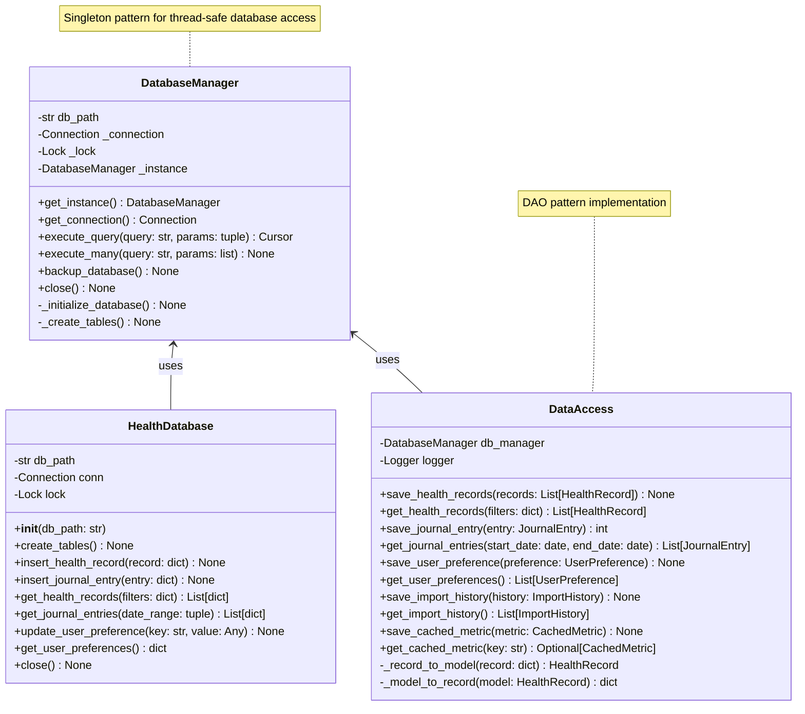
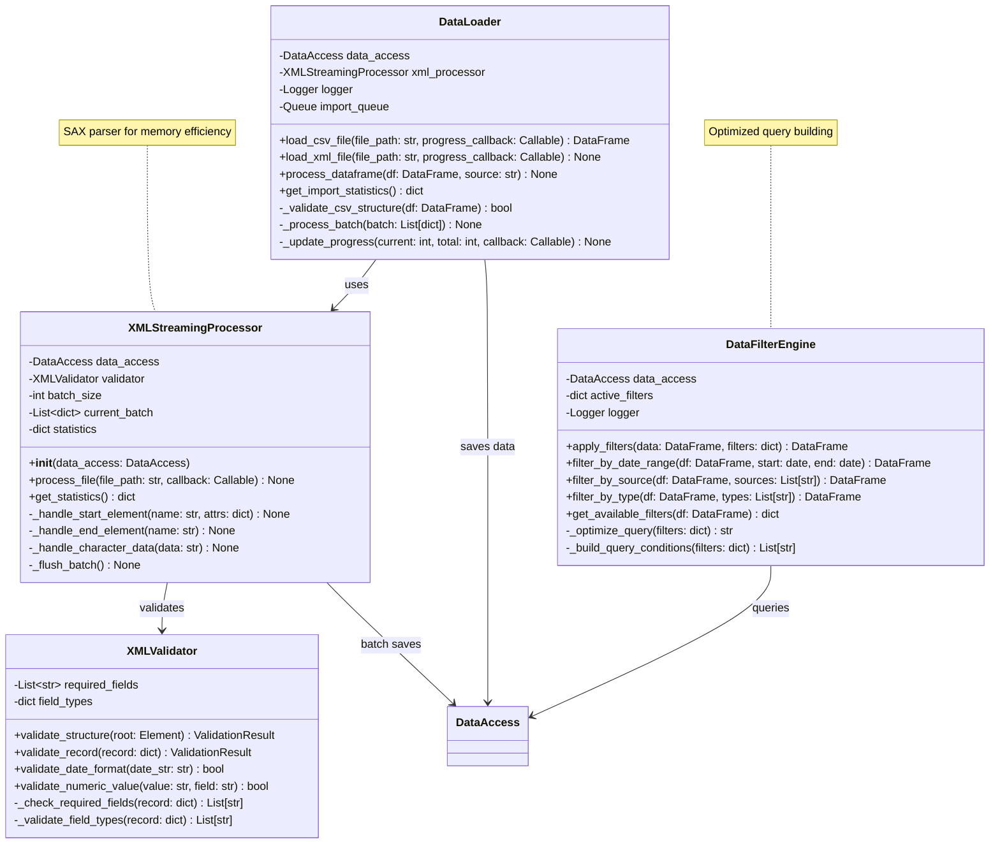
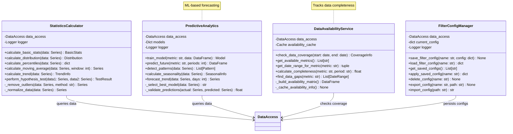
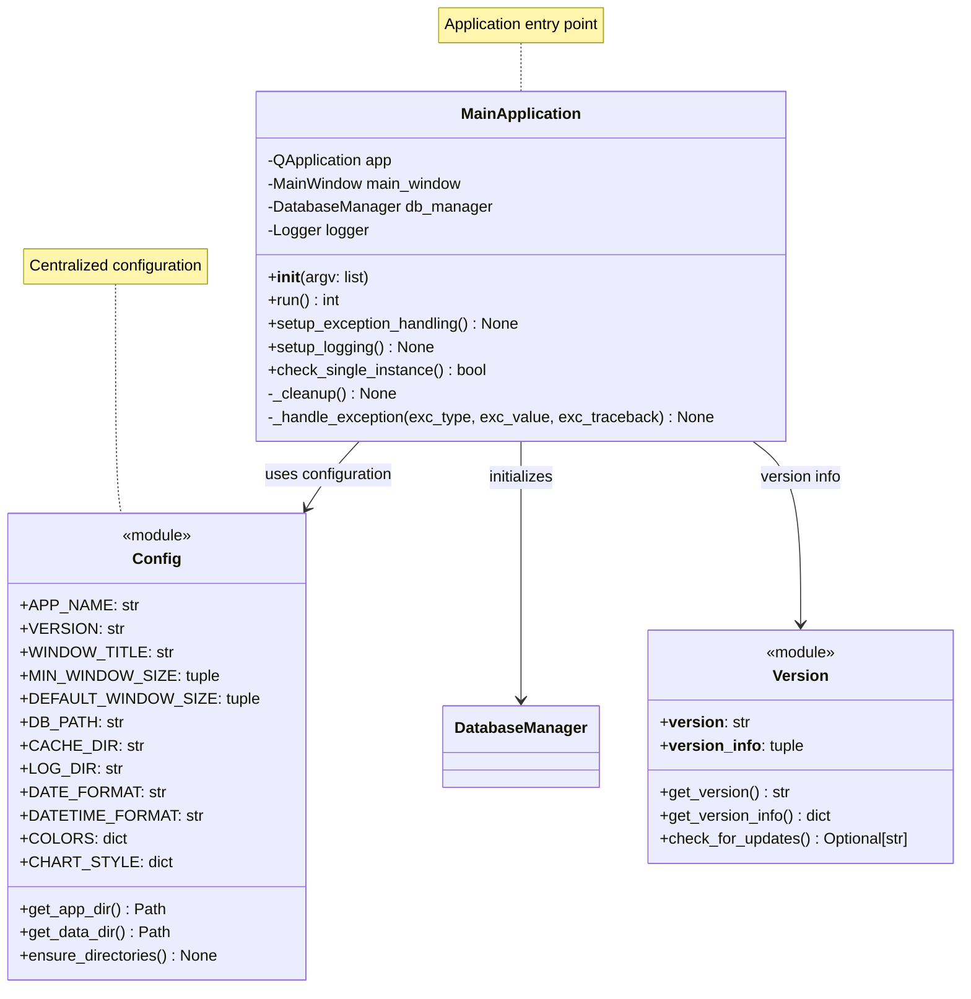

# Core Classes

This document details the core classes responsible for database operations, data access patterns, and fundamental data processing in the Apple Health Monitor Dashboard.

## Database Management Classes

## Data Loading and Processing Classes

## Statistics and Analytics Core

## Configuration and Application Core

## Key Design Patterns

### Singleton Pattern
- **DatabaseManager**: Ensures single database connection across the application
- Thread-safe implementation with locks

### Data Access Object (DAO) Pattern
- **DataAccess**: Abstracts database operations from business logic
- Provides model-to-database mapping

### Factory Pattern
- **XMLStreamingProcessor**: Creates appropriate parser based on file type
- **DataLoader**: Creates appropriate loader for CSV/XML

### Observer Pattern
- Progress callbacks in data loading operations
- Real-time UI updates during long operations

### Strategy Pattern
- **DataFilterEngine**: Different filtering strategies based on criteria
- **StatisticsCalculator**: Multiple statistical methods