# Apple Health Monitor - Core Classes

This diagram shows the core data processing classes and their relationships.

```mermaid
classDiagram
    %% Database Management
    class DatabaseManager {
        -str db_path
        -bool initialized
        -DatabaseManager _instance
        -Lock _lock
        +__new__() DatabaseManager
        +__init__(db_path: str)
        +get_connection() Iterator~Connection~
        +initialize_database()
        +execute_query(query: str, params: tuple) List
        +execute_command(command: str, params: tuple) int
        +execute_many(command: str, params_list: List) int
        +table_exists(table_name: str) bool
        -_ensure_database_exists()
        -_apply_migrations(conn: Connection)
    }

    %% Data Loader
    class DataLoader {
        -Logger logger
        -str db_path
        +__init__(db_path: str)
        +load_csv(csv_path: str) DataFrame
        +get_all_records() DataFrame
        -_infer_source_name(record_type: str) str
    }

    %% Module functions (represented as a service class)
    class DataLoaderModule {
        <<module>>
        +convert_xml_to_sqlite(xml_path: str, db_path: str) int
        +convert_xml_to_sqlite_with_validation(xml_path: str, db_path: str) tuple
        +query_date_range(db_path: str, start: date, end: date, types: List) DataFrame
        +get_daily_summary(db_path: str, types: List) DataFrame
        +get_weekly_summary(db_path: str, types: List) DataFrame
        +get_monthly_summary(db_path: str, types: List) DataFrame
        +get_available_types(db_path: str) List
        +get_date_range(db_path: str) tuple
        +migrate_csv_to_sqlite(csv_path: str, db_path: str)
        +validate_database(db_path: str) tuple
    }

    %% DAO Base Pattern
    class BaseDAO {
        <<interface>>
        #DatabaseManager db_manager
        #Logger logger
    }

    %% Specific DAOs
    class JournalDAO {
        +save_journal_entry(entry: JournalEntry) int
        +get_journal_entries(entry_type: str, limit: int) List~JournalEntry~
        +search_journal_entries(search_term: str) List~JournalEntry~
    }

    class PreferenceDAO {
        +get_preference(key: str, default: Any) Any
        +set_preference(key: str, value: Any, data_type: str)
        +get_all_preferences() Dict
    }

    class RecentFilesDAO {
        +add_recent_file(file_path: str, file_size: int)
        +get_recent_files(limit: int) List~RecentFile~
        +mark_file_invalid(file_path: str)
    }

    class CacheDAO {
        +cache_metrics(key_params: Dict, data: DataFrame, expires_in: int)
        +get_cached_metrics(key_params: Dict) DataFrame
        +clean_expired_cache()
        -_generate_cache_key(params: Dict) str
    }

    class MetricsMetadataDAO {
        +get_metric_metadata(metric_type: str) HealthMetricsMetadata
        +update_metric_metadata(metadata: HealthMetricsMetadata)
        +get_metrics_by_category(category: str) List~HealthMetricsMetadata~
    }

    class DataSourceDAO {
        +register_data_source(source: DataSource)
        +get_active_sources() List~DataSource~
        +update_source_activity(source_name: str)
    }

    class ImportHistoryDAO {
        +record_import(history: ImportHistory)
        +get_import_history(limit: int) List~ImportHistory~
        +is_file_imported(file_hash: str) bool
    }

    %% Relationships
    DatabaseManager <.. DataLoader : uses
    DatabaseManager <.. BaseDAO : uses
    BaseDAO <|-- JournalDAO : implements
    BaseDAO <|-- PreferenceDAO : implements
    BaseDAO <|-- RecentFilesDAO : implements
    BaseDAO <|-- CacheDAO : implements
    BaseDAO <|-- MetricsMetadataDAO : implements
    BaseDAO <|-- DataSourceDAO : implements
    BaseDAO <|-- ImportHistoryDAO : implements
    
    DataLoaderModule ..> DatabaseManager : uses
    DataLoader ..> DataLoaderModule : part of

    %% Notes
    note for DatabaseManager "Singleton pattern ensures single DB connection"
    note for BaseDAO "Abstract base for all DAO classes"
    note for CacheDAO "Implements performance caching with expiration"
```



## Class Interactions


## Key Design Patterns

### Singleton Pattern
The `DatabaseManager` uses the singleton pattern to ensure only one instance manages database connections:

```python
class DatabaseManager:
    _instance = None
    _lock = threading.Lock()
    
    def __new__(cls, db_path=None):
        if not cls._instance:
            with cls._lock:
                if not cls._instance:
                    cls._instance = super().__new__(cls)
        return cls._instance
```

### Context Manager Pattern
Database connections are managed using context managers:

```python
@contextmanager
def get_connection(self):
    conn = sqlite3.connect(self.db_path)
    try:
        yield conn
    finally:
        conn.close()
```

### Data Access Object (DAO) Pattern
Each entity type has a dedicated DAO that encapsulates database operations:

```python
class JournalDAO:
    def __init__(self):
        self.db_manager = DatabaseManager()
        
    def save_journal_entry(self, entry: JournalEntry) -> int:
        # Encapsulates journal-specific DB operations
        pass
```

### Factory Pattern
Model classes provide factory methods for serialization:

```python
@classmethod
def from_dict(cls, data: Dict[str, Any]) -> 'JournalEntry':
    # Factory method to create instance from dictionary
    pass
```