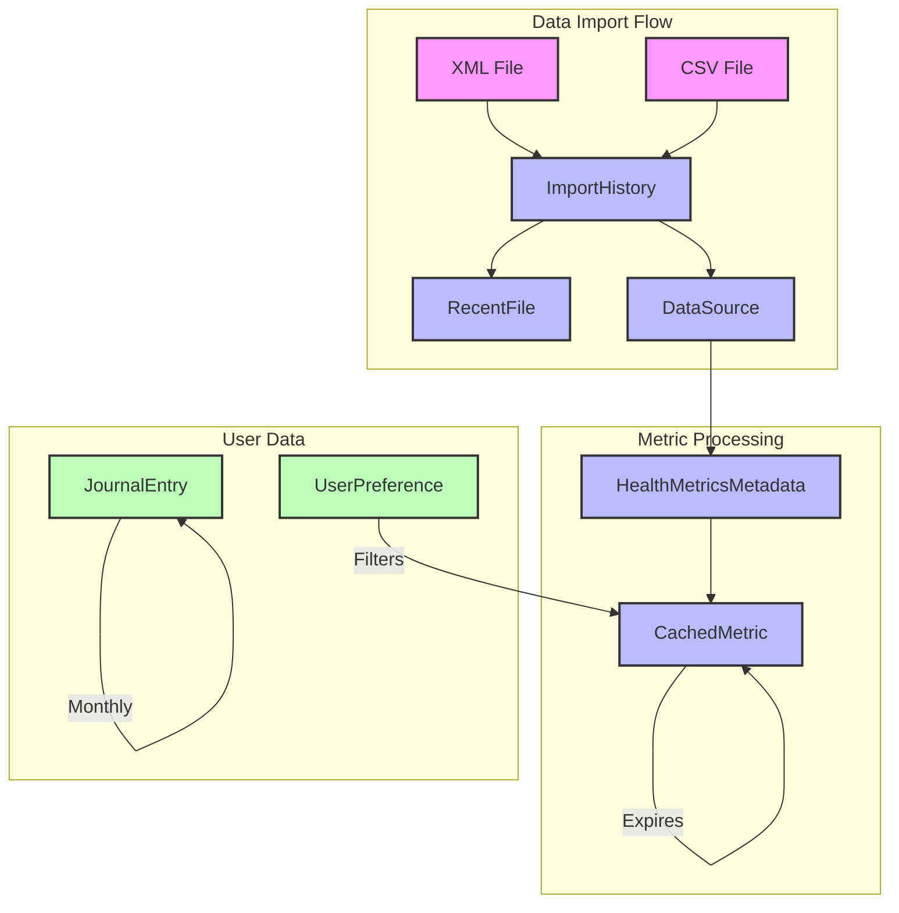
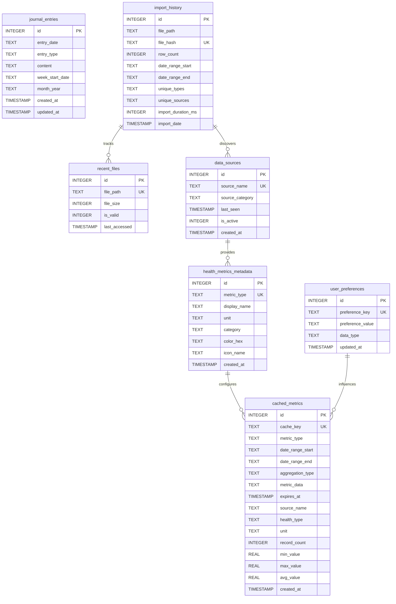

# Apple Health Monitor - Data Models

This diagram shows all data model classes, their attributes, and relationships.

```mermaid
classDiagram
    %% Base Model Interface
    class BaseModel {
        <<interface>>
        +to_dict() Dict
        +from_dict(data: Dict) BaseModel
    }

    %% Journal Entry Model
    class JournalEntry {
        +str entry_date
        +str entry_type
        +str content
        +str week_start_date
        +str month_year
        +int id
        +str created_at
        +str updated_at
        +__post_init__()
        +to_dict() Dict
        +from_dict(data: Dict) JournalEntry
    }

    %% User Preference Model
    class UserPreference {
        +str preference_key
        +str preference_value
        +str data_type
        +int id
        +str updated_at
        +__post_init__()
        +get_typed_value() Any
        +set_typed_value(value: Any)
        +to_dict() Dict
        +from_dict(data: Dict) UserPreference
    }

    %% Recent File Model
    class RecentFile {
        +str file_path
        +int file_size
        +bool is_valid
        +int id
        +str last_accessed
        +to_dict() Dict
        +from_dict(data: Dict) RecentFile
    }

    %% Cached Metric Model
    class CachedMetric {
        +str cache_key
        +str metric_type
        +str date_range_start
        +str date_range_end
        +str aggregation_type
        +str metric_data
        +str expires_at
        +str source_name
        +str health_type
        +str unit
        +int record_count
        +float min_value
        +float max_value
        +float avg_value
        +int id
        +str created_at
        +__post_init__()
        +is_expired() bool
        +to_dict() Dict
        +from_dict(data: Dict) CachedMetric
    }

    %% Health Metrics Metadata Model
    class HealthMetricsMetadata {
        +str metric_type
        +str display_name
        +str unit
        +str category
        +str color_hex
        +str icon_name
        +int id
        +str created_at
        +to_dict() Dict
        +from_dict(data: Dict) HealthMetricsMetadata
    }

    %% Data Source Model
    class DataSource {
        +str source_name
        +str source_category
        +str last_seen
        +bool is_active
        +int id
        +str created_at
        +to_dict() Dict
        +from_dict(data: Dict) DataSource
    }

    %% Import History Model
    class ImportHistory {
        +str file_path
        +str file_hash
        +int row_count
        +str date_range_start
        +str date_range_end
        +str unique_types
        +str unique_sources
        +int import_duration_ms
        +int id
        +str import_date
        +to_dict() Dict
        +from_dict(data: Dict) ImportHistory
    }

    %% Relationships
    BaseModel <|.. JournalEntry : implements
    BaseModel <|.. UserPreference : implements
    BaseModel <|.. RecentFile : implements
    BaseModel <|.. CachedMetric : implements
    BaseModel <|.. HealthMetricsMetadata : implements
    BaseModel <|.. DataSource : implements
    BaseModel <|.. ImportHistory : implements

    %% Annotations
    note for JournalEntry "Supports daily, weekly, and monthly entries"
    note for UserPreference "Type-safe preference storage with JSON support"
    note for CachedMetric "Performance optimization with TTL"
    note for HealthMetricsMetadata "Display configuration for health metrics"
```

## Model Relationships and Usage

## Database Schema

## Model Features

### Type Safety
All models use Python's `@dataclass` decorator with type hints:
- Automatic `__init__`, `__repr__`, and `__eq__` methods
- IDE support for type checking
- Runtime validation with `__post_init__`

### Serialization
All models implement consistent serialization:
- `to_dict()`: Convert model to dictionary for storage
- `from_dict()`: Create model instance from dictionary
- JSON-compatible data types

### Special Features

**JournalEntry**:
- Supports multiple entry types (daily, weekly, monthly)
- Automatic timestamp management
- Full-text search capability

**UserPreference**:
- Type-safe value storage
- JSON serialization for complex values
- Key-based lookup

**CachedMetric**:
- TTL-based expiration
- Aggregated statistics storage
- Performance optimization

**ImportHistory**:
- File deduplication via hash
- Import performance tracking
- Data range tracking