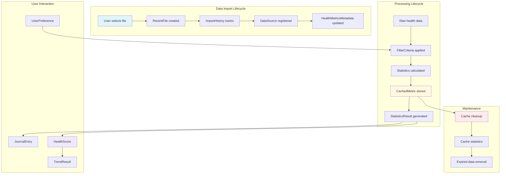
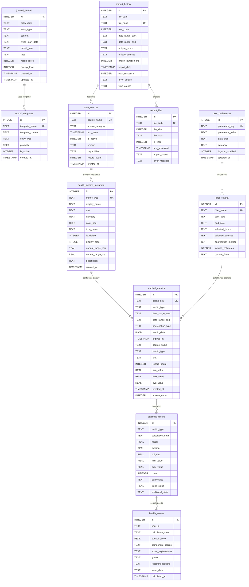

# Apple Health Monitor Dashboard - Data Models & Domain Objects

This diagram shows all data model classes, their attributes, relationships, and domain-specific behavior throughout the application.

## Core Data Models

```mermaid
classDiagram
    %% Base Model Protocol
    class BaseModel {
        <<protocol>>
        +to_dict() Dict[str, Any]
        +from_dict(data: Dict[str, Any]) Self
        +validate() bool
        +__post_init__() void
    }

    %% Journal System Models
    class JournalEntry {
        <<dataclass>>
        +int id
        +str entry_date
        +str entry_type
        +str content
        +str week_start_date
        +str month_year
        +datetime created_at
        +datetime updated_at
        +tags: List[str]
        +mood_score: Optional[int]
        +energy_level: Optional[int]
        +__post_init__() void
        +validate_date_format() bool
        +get_entry_word_count() int
        +extract_keywords() List[str]
        +to_dict() Dict[str, Any]
        +from_dict(data: Dict) JournalEntry
        +get_date_object() date
        +is_editable() bool
    }

    class JournalTemplate {
        <<dataclass>>
        +int id
        +str template_name
        +str template_content
        +str entry_type
        +List[str] prompts
        +bool is_active
        +datetime created_at
        +to_dict() Dict[str, Any]
        +from_dict(data: Dict) JournalTemplate
        +render_template(context: Dict) str
    }

    %% Configuration Models
    class UserPreference {
        <<dataclass>>
        +int id
        +str preference_key
        +str preference_value
        +str data_type
        +str category
        +bool is_user_modified
        +datetime updated_at
        +__post_init__() void
        +get_typed_value() Any
        +set_typed_value(value: Any) void
        +validate_value() bool
        +to_dict() Dict[str, Any]
        +from_dict(data: Dict) UserPreference
        +reset_to_default() void
        +export_for_backup() Dict
    }

    class FilterCriteria {
        <<dataclass>>
        +str filter_name
        +date start_date
        +date end_date
        +List[str] selected_types
        +List[str] selected_sources
        +str aggregation_method
        +bool include_estimates
        +Dict[str, Any] custom_filters
        +__post_init__() void
        +validate_date_range() bool
        +to_query_params() Dict
        +from_dict(data: Dict) FilterCriteria
        +get_cache_key() str
        +is_default() bool
    }

    %% File & Import Models
    class RecentFile {
        <<dataclass>>
        +int id
        +str file_path
        +int file_size
        +str file_hash
        +bool is_valid
        +datetime last_accessed
        +str import_status
        +Optional[str] error_message
        +__post_init__() void
        +get_display_name() str
        +get_size_formatted() str
        +mark_as_invalid(error: str) void
        +to_dict() Dict[str, Any]
        +from_dict(data: Dict) RecentFile
        +validate_file_exists() bool
    }

    class ImportHistory {
        <<dataclass>>
        +int id
        +str file_path
        +str file_hash
        +int row_count
        +date date_range_start
        +date date_range_end
        +List[str] unique_types
        +List[str] unique_sources
        +int import_duration_ms
        +datetime import_date
        +bool was_successful
        +Optional[str] error_details
        +Dict[str, int] type_counts
        +__post_init__() void
        +get_duration_formatted() str
        +get_import_rate() float
        +to_dict() Dict[str, Any]
        +from_dict(data: Dict) ImportHistory
        +calculate_statistics() Dict
    }

    %% Caching Models
    class CachedMetric {
        <<dataclass>>
        +int id
        +str cache_key
        +str metric_type
        +date date_range_start
        +date date_range_end
        +str aggregation_type
        +bytes metric_data
        +datetime expires_at
        +str source_name
        +str health_type
        +str unit
        +int record_count
        +Optional[float] min_value
        +Optional[float] max_value
        +Optional[float] avg_value
        +datetime created_at
        +int access_count
        +__post_init__() void
        +is_expired() bool
        +extend_expiry(hours: int) void
        +get_data_as_dataframe() DataFrame
        +set_data_from_dataframe(df: DataFrame) void
        +to_dict() Dict[str, Any]
        +from_dict(data: Dict) CachedMetric
        +get_cache_efficiency() float
    }

    class CacheStatistics {
        <<dataclass>>
        +int total_entries
        +int expired_entries
        +float hit_rate
        +float miss_rate
        +int total_size_bytes
        +datetime last_cleanup
        +Dict[str, int] type_distribution
        +calculate_efficiency() float
        +needs_cleanup() bool
        +to_dict() Dict[str, Any]
    }

    %% Health Data Models
    class HealthMetricsMetadata {
        <<dataclass>>
        +int id
        +str metric_type
        +str display_name
        +str unit
        +str category
        +str color_hex
        +str icon_name
        +bool is_visible
        +int display_order
        +Optional[float] normal_range_min
        +Optional[float] normal_range_max
        +str description
        +datetime created_at
        +__post_init__() void
        +validate_color() bool
        +get_color_rgb() Tuple[int, int, int]
        +is_in_normal_range(value: float) bool
        +to_dict() Dict[str, Any]
        +from_dict(data: Dict) HealthMetricsMetadata
        +get_display_config() Dict
    }

    class DataSource {
        <<dataclass>>
        +int id
        +str source_name
        +str source_category
        +datetime last_seen
        +bool is_active
        +str version
        +Dict[str, Any] capabilities
        +int record_count
        +datetime created_at
        +__post_init__() void
        +mark_as_active() void
        +mark_as_inactive() void
        +update_activity() void
        +to_dict() Dict[str, Any]
        +from_dict(data: Dict) DataSource
        +get_activity_status() str
        +days_since_last_seen() int
    }

    %% Analytics Models
    class StatisticsResult {
        <<dataclass>>
        +str metric_type
        +date calculation_date
        +float mean
        +float median
        +float std_dev
        +float min_value
        +float max_value
        +int count
        +List[float] percentiles
        +Optional[float] trend_slope
        +Dict[str, Any] additional_stats
        +to_dict() Dict[str, Any]
        +from_dict(data: Dict) StatisticsResult
        +has_sufficient_data() bool
        +get_trend_direction() str
    }

    class TrendResult {
        <<dataclass>>
        +str metric_type
        +str trend_type
        +float slope
        +float r_squared
        +str direction
        +float confidence
        +List[Tuple[date, float]] trend_points
        +Dict[str, Any] seasonality
        +to_dict() Dict[str, Any]
        +from_dict(data: Dict) TrendResult
        +is_significant() bool
        +get_trend_summary() str
    }

    %% Health Scoring Models
    class HealthScore {
        <<dataclass>>
        +str user_id
        +date calculation_date
        +float overall_score
        +Dict[str, float] component_scores
        +Dict[str, str] score_explanations
        +str grade
        +List[str] recommendations
        +Dict[str, Any] trend_data
        +datetime calculated_at
        +to_dict() Dict[str, Any]
        +from_dict(data: Dict) HealthScore
        +get_grade_color() str
        +get_primary_recommendations() List[str]
        +compare_to_previous(previous: HealthScore) Dict
    }

    %% Relationships
    BaseModel <|.. JournalEntry : implements
    BaseModel <|.. JournalTemplate : implements
    BaseModel <|.. UserPreference : implements
    BaseModel <|.. FilterCriteria : implements
    BaseModel <|.. RecentFile : implements
    BaseModel <|.. ImportHistory : implements
    BaseModel <|.. CachedMetric : implements
    BaseModel <|.. HealthMetricsMetadata : implements
    BaseModel <|.. DataSource : implements
    BaseModel <|.. StatisticsResult : implements
    BaseModel <|.. TrendResult : implements
    BaseModel <|.. HealthScore : implements

    JournalEntry --> JournalTemplate : uses
    CachedMetric --> HealthMetricsMetadata : references
    ImportHistory --> RecentFile : tracks
    ImportHistory --> DataSource : discovers
    StatisticsResult --> TrendResult : generates
    HealthScore --> StatisticsResult : uses

    %% Notes
    note for JournalEntry "Rich journal system with mood tracking\nand keyword extraction"
    note for CachedMetric "High-performance caching with\ncompression and statistics"
    note for HealthScore "Comprehensive health assessment\nwith personalized recommendations"
    note for FilterCriteria "Flexible filtering system\nwith query optimization"
```



## Data Flow & Lifecycle



## Domain Model Relationships



## Model Design Principles

### 1. Type Safety & Validation
```python
@dataclass
class JournalEntry:
    entry_date: str
    mood_score: Optional[int] = None
    
    def __post_init__(self):
        # Validate mood score range
        if self.mood_score is not None:
            if not 1 <= self.mood_score <= 10:
                raise ValueError("Mood score must be between 1 and 10")
        
        # Validate date format
        self.validate_date_format()
```

### 2. Rich Domain Behavior
```python
class HealthScore:
    def get_grade_color(self) -> str:
        """Return color code based on grade."""
        grade_colors = {
            'A': '#4caf50',  # Green
            'B': '#8bc34a',  # Light Green  
            'C': '#ffc107',  # Amber
            'D': '#ff9800',  # Orange
            'F': '#f44336'   # Red
        }
        return grade_colors.get(self.grade, '#757575')
```

### 3. Flexible Serialization
```python
class BaseModel:
    def to_dict(self) -> Dict[str, Any]:
        """Convert to dictionary with null handling."""
        result = {}
        for field in fields(self):
            value = getattr(self, field.name)
            if isinstance(value, (list, dict)):
                result[field.name] = json.dumps(value)
            elif isinstance(value, datetime):
                result[field.name] = value.isoformat()
            else:
                result[field.name] = value
        return result
```

### 4. Performance Optimization
```python
class CachedMetric:
    def get_cache_efficiency(self) -> float:
        """Calculate cache hit efficiency."""
        if self.access_count == 0:
            return 0.0
        
        time_since_creation = (datetime.now() - self.created_at).total_seconds()
        efficiency = self.access_count / max(time_since_creation / 3600, 1)
        return min(efficiency, 1.0)  # Cap at 100%
```

## Model Usage Patterns

### 1. Data Import & Tracking
```python
# Create import history record
import_record = ImportHistory(
    file_path='/path/to/export.xml',
    file_hash='sha256_hash',
    row_count=50000,
    date_range_start=date(2023, 1, 1),
    date_range_end=date(2024, 1, 1),
    unique_types=['steps', 'heart_rate', 'sleep'],
    unique_sources=['iPhone', 'Apple Watch'],
    import_duration_ms=5000,
    was_successful=True
)

# Track recent files
recent_file = RecentFile(
    file_path=import_record.file_path,
    file_hash=import_record.file_hash,
    file_size=1024000,
    is_valid=True,
    import_status='completed'
)
```

### 2. Configuration Management
```python
# Store user preferences with type safety
preference = UserPreference(
    preference_key='default_chart_type',
    preference_value='line',
    data_type='string',
    category='ui'
)

# Store complex preferences as JSON
filter_pref = UserPreference(
    preference_key='default_filters',
    preference_value=json.dumps({
        'metrics': ['steps', 'heart_rate'],
        'date_range_days': 30,
        'include_estimates': False
    }),
    data_type='json',
    category='data'
)
```

### 3. Health Data Analysis
```python
# Calculate and store health score
score = HealthScore(
    user_id='user123',
    calculation_date=date.today(),
    overall_score=85.2,
    component_scores={
        'activity': 90.0,
        'sleep': 80.0,
        'heart_health': 85.5
    },
    grade='B+',
    recommendations=[
        'Increase weekly exercise by 10%',
        'Maintain consistent sleep schedule'
    ]
)

# Store calculation results
stats = StatisticsResult(
    metric_type='steps',
    calculation_date=date.today(),
    mean=8500.0,
    median=8200.0,
    std_dev=1200.0,
    min_value=5500.0,
    max_value=12000.0,
    count=30,
    percentiles=[25, 50, 75, 90, 95]
)
```

### 4. Caching Strategy
```python
# Store computed metrics with TTL
cached_metric = CachedMetric(
    cache_key='steps_monthly_2024_01',
    metric_type='steps',
    date_range_start=date(2024, 1, 1),
    date_range_end=date(2024, 1, 31),
    aggregation_type='daily_sum',
    metric_data=pickle.dumps(dataframe),  # Compressed data
    expires_at=datetime.now() + timedelta(hours=6),
    record_count=31,
    min_value=5000.0,
    max_value=12000.0,
    avg_value=8500.0
)

# Check cache validity
if not cached_metric.is_expired():
    data = cached_metric.get_data_as_dataframe()
```

## Data Quality & Validation

### Model Validation Rules
- **Date Consistency**: Start dates must be <= end dates
- **Value Ranges**: Health scores 0-100, mood scores 1-10
- **Required Fields**: Non-null constraints on essential fields
- **Format Validation**: Email, color hex codes, file paths
- **Referential Integrity**: Foreign key relationships

### Error Handling Strategy
```python
class HealthMetricsMetadata:
    def validate_color(self) -> bool:
        """Validate hex color format."""
        import re
        pattern = r'^#[0-9a-fA-F]{6}$'
        return bool(re.match(pattern, self.color_hex))
    
    def __post_init__(self):
        if not self.validate_color():
            raise ValueError(f"Invalid color format: {self.color_hex}")
```

## Performance Considerations

### 1. Lazy Loading
- Journal entries load content on demand
- Large binary data (charts, exports) stored separately
- Pagination for large result sets

### 2. Indexing Strategy
- Primary keys on all ID fields
- Unique constraints on natural keys (file_hash, cache_key)
- Composite indexes on frequently queried combinations
- Date range indexes for time-series queries

### 3. Data Compression
- CachedMetric stores DataFrame as compressed bytes
- JSON preferences compressed for large configurations
- File content hashing prevents duplicate storage