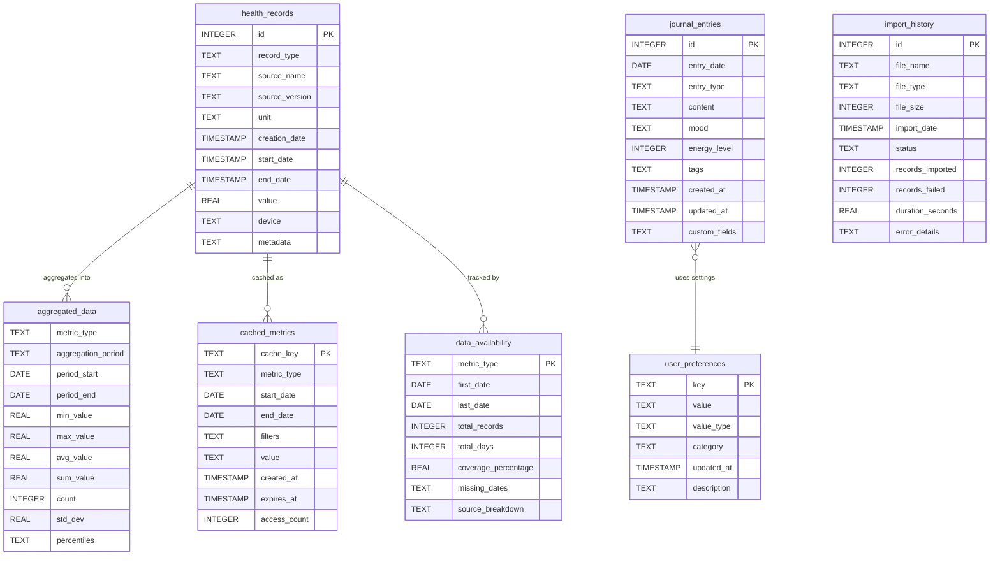
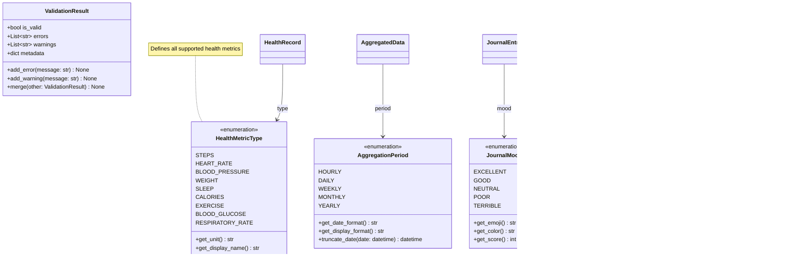

# Data Models

This document details the domain models and database schema used in the Apple Health Monitor Dashboard application.

## Domain Model Overview

## Database Schema

## Model Relationships and Business Logic

## Analytics Models

## Data Transformation Models

## Key Model Features

### Data Validation
- All models include validation in `__post_init__`
- Type checking and range validation
- Business rule enforcement

### Serialization
- `to_dict()` and `from_dict()` for all models
- JSON-compatible serialization
- Preserves type information

### Caching Support
- Models designed for efficient caching
- Immutable where appropriate
- Cache key generation built-in

### Extensibility
- Custom fields support in Journal and Preferences
- Metadata fields for future expansion
- Backwards compatibility considered