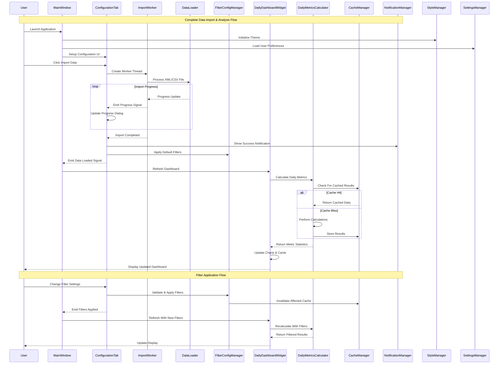
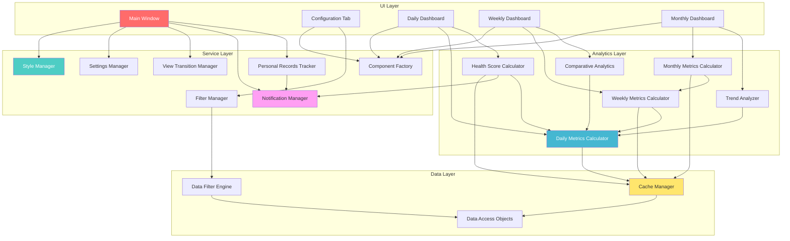
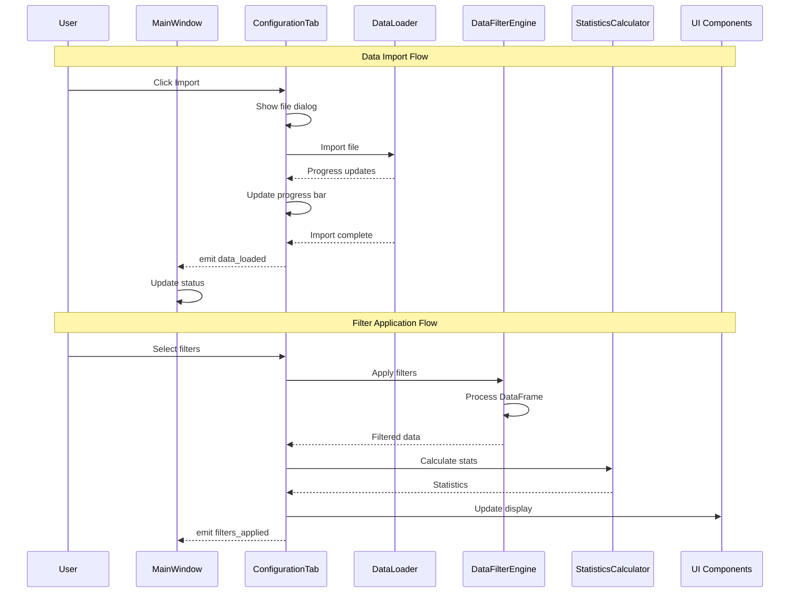
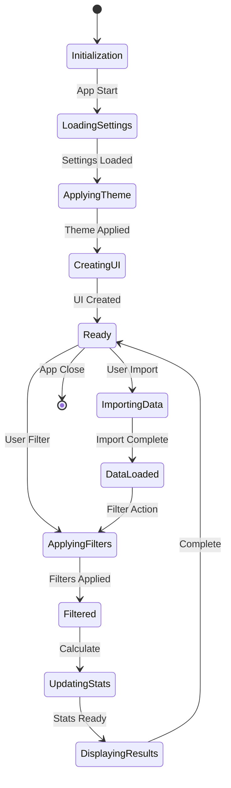

# Apple Health Monitor Dashboard - Service Layer & UI Architecture

This diagram shows the service layer components, UI architecture, analytics services, and their interactions throughout the entire application.

## Complete Service Layer Architecture

```mermaid
classDiagram
    %% Qt Framework Base Classes
    class QMainWindow {
        <<Qt Framework>>
        +show() void
        +closeEvent(event: QCloseEvent) void
    }
    
    class QWidget {
        <<Qt Framework>>
        +setStyleSheet(stylesheet: str) void
        +update() void
    }
    
    class QComboBox {
        <<Qt Framework>>
        +addItems(items: List[str]) void
        +currentTextChanged: pyqtSignal
    }

    %% Main Application Window
    class MainWindow {
        -StyleManager style_manager
        -SettingsManager settings_manager
        -ViewTransitionManager transition_manager
        -PersonalRecordsTracker records_tracker
        -NotificationManager notification_manager
        -QTabWidget tab_widget
        -ConfigurationTab config_tab
        -DailyDashboardWidget daily_tab
        -WeeklyDashboardWidget weekly_tab
        -MonthlyDashboardWidget monthly_tab
        +pyqtSignal tab_changed
        +__init__()
        +setup_ui() void
        +create_menus() void
        +load_user_preferences() void
        +show_help() void
        +show_about() void
        -_on_tab_changed(index: int) void
        -_handle_window_state_change() void
        -_setup_keyboard_shortcuts() void
    }

    %% Configuration & Control Layer
    class ConfigurationTab {
        -StyleManager style_manager
        -ComponentFactory component_factory
        -DataLoader data_loader
        -FilterConfigManager filter_manager
        -ImportProgressDialog progress_dialog
        -ImportWorker import_worker
        -MultiSelectCombo device_dropdown
        -MultiSelectCombo type_dropdown
        -EnhancedDateEdit start_date
        -EnhancedDateEdit end_date
        -QPushButton import_button
        +pyqtSignal data_loaded
        +pyqtSignal filters_applied
        +pyqtSignal import_started
        +pyqtSignal import_completed
        +__init__()
        +setup_ui() void
        +import_data() void
        +apply_filters() void
        +reset_filters() void
        +update_statistics() void
        -_on_import_finished(success: bool) void
        -_validate_filter_criteria() bool
        -_save_current_filters() void
    }

    class MultiSelectCombo {
        -QStandardItemModel model
        -QListView list_view
        -bool prevent_popup_close
        -str placeholder_text
        +pyqtSignal selectionChanged
        +__init__(placeholder: str)
        +add_items(items: List[str]) void
        +get_selected_items() List[str]
        +set_selected_items(items: List[str]) void
        +clear_selection() void
        +select_all() void
        +get_selection_count() int
        -_update_display_text() void
        -_on_item_changed(item: QStandardItem) void
        -_handle_popup_close() void
    }

    %% Dashboard Layer
    class DailyDashboardWidget {
        -DailyMetricsCalculator metrics_calculator
        -ComponentFactory component_factory
        -HealthScoreCalculator health_score_calc
        -LineChart main_chart
        -StatisticsWidget stats_widget
        -SummaryCards summary_cards
        +pyqtSignal date_changed
        +__init__()
        +setup_ui() void
        +refresh_data() void
        +set_date_range(start: date, end: date) void
        +export_chart() void
        -_calculate_daily_metrics() void
        -_update_chart_data() void
        -_update_summary_cards() void
    }

    class WeeklyDashboardWidget {
        -WeeklyMetricsCalculator metrics_calculator
        -ComparativeAnalytics comparative_analytics
        -EnhancedLineChart trend_chart
        -WeekOverWeekWidget comparison_widget
        -TrendCalculator trend_calculator
        +pyqtSignal week_changed
        +__init__()
        +setup_ui() void
        +refresh_data() void
        +set_week_range(weeks: int) void
        +show_comparison_overlay() void
        -_calculate_weekly_trends() void
        -_update_trend_visualization() void
        -_generate_weekly_insights() void
    }

    class MonthlyDashboardWidget {
        -MonthlyMetricsCalculator metrics_calculator
        -MonthOverMonthTrends mom_trends
        -CalendarHeatmap calendar_heatmap
        -MonthlyContextWidget context_widget
        -GoalProgressWidget goal_widget
        +pyqtSignal month_changed
        +__init__()
        +setup_ui() void
        +refresh_data() void
        +set_month(month: date) void
        +toggle_calendar_view() void
        -_calculate_monthly_summary() void
        -_update_calendar_heatmap() void
        -_generate_monthly_insights() void
    }

    %% Core Service Layer
    class StyleManager {
        <<Singleton>>
        +COLORS: Dict[str, str]
        +FONTS: Dict[str, QFont]
        +current_theme: str
        +get_main_stylesheet() str
        +get_button_style(variant: str) str
        +get_combobox_style() str
        +get_table_style() str
        +get_tab_style() str
        +get_chart_style() Dict
        +apply_theme(widget: QWidget) void
        +set_theme(theme_name: str) void
        +get_color_palette() List[str]
        +get_accent_color() str
        -_load_theme_config() Dict
    }

    class SettingsManager {
        -PreferenceDAO preference_dao
        -Dict[str, Any] settings_cache
        -bool auto_save_enabled
        +load_settings() Dict[str, Any]
        +save_settings(settings: Dict) void
        +get_setting(key: str, default: Any) Any
        +set_setting(key: str, value: Any) void
        +reset_to_defaults() void
        +export_settings() str
        +import_settings(settings_json: str) bool
        +get_recent_files() List[str]
        +add_recent_file(file_path: str) void
        -_validate_setting(key: str, value: Any) bool
        -_auto_save() void
    }

    class ComponentFactory {
        -StyleManager style_manager
        -Dict[str, Callable] component_registry
        +create_button(text: str, variant: str) QPushButton
        +create_date_edit(date_range: Tuple) EnhancedDateEdit
        +create_dropdown(placeholder: str, multi_select: bool) QComboBox
        +create_summary_card(title: str, config: Dict) SummaryCards
        +create_chart(chart_type: str, config: Dict) BaseChart
        +create_statistics_widget(metrics: List[str]) StatisticsWidget
        +register_component(name: str, factory: Callable) void
        +create_custom_component(name: str, **kwargs) QWidget
        -_apply_standard_styling(widget: QWidget) void
    }

    %% Analytics Service Layer
    class DailyMetricsCalculator {
        -CacheManager cache_manager
        -DataSourceProtocol data_source
        -Logger logger
        +__init__(data_source: DataSourceProtocol)
        +calculate_statistics(metric: str, date_range: Tuple) MetricStatistics
        +calculate_percentiles(metric: str, percentiles: List[int]) Dict
        +detect_outliers(metric: str, method: OutlierMethod) pd.Series
        +get_metrics_summary(metrics: List[str]) Dict
        +calculate_daily_aggregates(metric: str, aggregation: str) pd.Series
        -_filter_metric_data(metric: str, dates: Tuple) pd.DataFrame
        -_interpolate_missing(values: np.ndarray, method: str) np.ndarray
    }

    class WeeklyMetricsCalculator {
        -DailyMetricsCalculator daily_calculator
        -CacheManager cache_manager
        +calculate_weekly_summary(metrics: List[str]) Dict
        +calculate_week_over_week_change(metric: str) Dict
        +get_weekly_trends(metric: str, weeks: int) TrendResult
        +calculate_weekly_patterns(metric: str) Dict
        +get_weekly_rankings(metrics: List[str]) Dict
        -_aggregate_daily_to_weekly(daily_data: pd.Series) pd.Series
        -_calculate_weekly_statistics(data: pd.Series) Dict
    }

    class MonthlyMetricsCalculator {
        -WeeklyMetricsCalculator weekly_calculator
        -CacheManager cache_manager
        -SeasonalPatternAnalyzer seasonal_analyzer
        +calculate_monthly_summary(metrics: List[str]) Dict
        +calculate_month_over_month_trends(metric: str) Dict
        +get_seasonal_patterns(metric: str) Dict
        +calculate_monthly_goals_progress(goals: Dict) Dict
        +get_monthly_insights(metrics: List[str]) List[str]
        -_aggregate_weekly_to_monthly(weekly_data: pd.Series) pd.Series
        -_calculate_monthly_comparisons(data: pd.Series) Dict
    }

    class HealthScoreCalculator {
        -ComponentCalculators component_calc
        -PersonalizationEngine personalization
        -TrendAnalyzer trend_analyzer
        +calculate_overall_score(metrics: Dict) HealthScore
        +calculate_component_scores(metrics: Dict) Dict[str, float]
        +generate_recommendations(score: HealthScore) List[str]
        +compare_to_baseline(current: HealthScore, baseline: HealthScore) Dict
        +get_score_history(days: int) List[HealthScore]
        -_weight_components(scores: Dict) float
        -_generate_insights(score: HealthScore) List[str]
    }

    %% Utility Services
    class FilterConfigManager {
        -PreferenceDAO preference_dao
        -DataFilterEngine filter_engine
        -Dict[str, Any] current_filters
        +save_filter_config(name: str, config: Dict) void
        +load_filter_config(name: str) Dict
        +get_saved_configs() List[str]
        +delete_filter_config(name: str) void
        +apply_filters(data: pd.DataFrame) pd.DataFrame
        +validate_filter_criteria(filters: Dict) bool
        +get_filter_summary() str
        +reset_to_defaults() void
        -_serialize_filters(filters: Dict) str
        -_deserialize_filters(filters_json: str) Dict
    }

    class ViewTransitionManager {
        -QTabWidget tab_widget
        -Dict[str, QPropertyAnimation] animations
        -int transition_duration
        +animate_tab_change(old_index: int, new_index: int) void
        +set_transition_duration(duration_ms: int) void
        +animate_widget_entry(widget: QWidget) void
        +animate_widget_exit(widget: QWidget) void
        +create_fade_transition(widget: QWidget) QPropertyAnimation
        +create_slide_transition(widget: QWidget, direction: str) QPropertyAnimation
        -_cleanup_completed_animations() void
    }

    class NotificationManager {
        -QSystemTrayIcon tray_icon
        -List[Dict] notification_queue
        -bool notifications_enabled
        +show_notification(title: str, message: str, type: str) void
        +show_achievement_notification(achievement: str) void
        +show_goal_progress_notification(progress: Dict) void
        +show_import_completion_notification(stats: Dict) void
        +enable_notifications() void
        +disable_notifications() void
        +clear_notifications() void
        -_process_notification_queue() void
        -_create_system_tray() void
    }

    class PersonalRecordsTracker {
        -PersonalRecordsDAO records_dao
        -CacheManager cache_manager
        -NotificationManager notification_manager
        +track_new_record(metric: str, value: float, date: date) bool
        +get_personal_best(metric: str) Optional[float]
        +get_records_summary() Dict[str, Any]
        +get_recent_achievements(days: int) List[Dict]
        +calculate_progress_towards_records() Dict
        +export_records_history() pd.DataFrame
        -_check_for_new_record(metric: str, value: float) bool
        -_notify_new_record(metric: str, value: float) void
        -_update_records_cache() void
    }

    %% Worker Classes
    class ImportWorker {
        <<QThread>>
        -str file_path
        -DataLoader data_loader
        +pyqtSignal progress_updated
        +pyqtSignal import_completed
        +pyqtSignal error_occurred
        +__init__(file_path: str)
        +run() void
        +cancel_import() void
        -_emit_progress(percentage: int, message: str) void
    }

    class ImportProgressDialog {
        -QProgressBar progress_bar
        -QLabel status_label
        -QPushButton cancel_button
        -ImportWorker worker
        +show_progress() void
        +update_progress(percentage: int, message: str) void
        +handle_completion(success: bool, stats: Dict) void
        +handle_error(error_message: str) void
        -_setup_ui() void
        -_connect_signals() void
    }

    %% Relationships - Main Window
    QMainWindow <|-- MainWindow : inherits
    MainWindow *-- StyleManager : manages
    MainWindow *-- SettingsManager : uses
    MainWindow *-- ViewTransitionManager : uses
    MainWindow *-- PersonalRecordsTracker : tracks
    MainWindow *-- NotificationManager : notifies
    MainWindow *-- ConfigurationTab : contains
    MainWindow *-- DailyDashboardWidget : contains
    MainWindow *-- WeeklyDashboardWidget : contains
    MainWindow *-- MonthlyDashboardWidget : contains

    %% Relationships - Configuration
    QWidget <|-- ConfigurationTab : inherits
    ConfigurationTab *-- ComponentFactory : uses
    ConfigurationTab *-- FilterConfigManager : manages
    ConfigurationTab *-- ImportProgressDialog : shows
    ConfigurationTab *-- ImportWorker : creates
    ConfigurationTab *-- MultiSelectCombo : contains

    %% Relationships - Dashboards
    QWidget <|-- DailyDashboardWidget : inherits
    QWidget <|-- WeeklyDashboardWidget : inherits
    QWidget <|-- MonthlyDashboardWidget : inherits

    DailyDashboardWidget *-- DailyMetricsCalculator : uses
    DailyDashboardWidget *-- HealthScoreCalculator : uses
    WeeklyDashboardWidget *-- WeeklyMetricsCalculator : uses
    MonthlyDashboardWidget *-- MonthlyMetricsCalculator : uses

    %% Relationships - Services
    ComponentFactory --> StyleManager : applies_styles
    FilterConfigManager --> DataFilterEngine : filters_data
    PersonalRecordsTracker --> NotificationManager : sends_notifications
    
    %% Relationships - Analytics Chain
    WeeklyMetricsCalculator --> DailyMetricsCalculator : aggregates
    MonthlyMetricsCalculator --> WeeklyMetricsCalculator : aggregates
    HealthScoreCalculator --> DailyMetricsCalculator : analyzes

    %% Relationships - Custom Widgets
    QComboBox <|-- MultiSelectCombo : inherits

    %% Notes
    note for StyleManager "WSJ-inspired theme system\nwith warm, professional colors"
    note for ComponentFactory "Ensures consistent UI creation\nwith proper styling applied"
    note for HealthScoreCalculator "Comprehensive health assessment\nwith personalized recommendations"
    note for NotificationManager "System tray notifications\nfor achievements and updates"
```



## Service Layer Interaction Patterns



## Dashboard Service Coordination



## UI Signal Flow



## Component Lifecycle



sequenceDiagram
    participant User
    participant MainWindow
    participant ConfigTab as ConfigurationTab
    participant DataLoader
    participant FilterEngine as DataFilterEngine
    participant StatsCalc as StatisticsCalculator
    participant UI as UI Components

    Note over User,UI: Data Import Flow
    User->>ConfigTab: Click Import
    ConfigTab->>ConfigTab: Show file dialog
    ConfigTab->>DataLoader: Import file
    DataLoader-->>ConfigTab: Progress updates
    ConfigTab->>ConfigTab: Update progress bar
    DataLoader-->>ConfigTab: Import complete
    ConfigTab-->>MainWindow: emit data_loaded
    MainWindow->>MainWindow: Update status

    Note over User,UI: Filter Application Flow
    User->>ConfigTab: Select filters
    ConfigTab->>FilterEngine: Apply filters
    FilterEngine->>FilterEngine: Process DataFrame
    FilterEngine-->>ConfigTab: Filtered data
    ConfigTab->>StatsCalc: Calculate stats
    StatsCalc-->>ConfigTab: Statistics
    ConfigTab->>UI: Update display
    ConfigTab-->>MainWindow: emit filters_applied
```

## Service Layer Design Patterns

### 1. Manager Pattern
Services that coordinate cross-cutting concerns:

```python
class StyleManager:
    """Centralized theme and styling management."""
    COLORS = {
        'primary': '#D2691E',      # Chocolate orange
        'secondary': '#F4A460',    # Sandy brown
        'accent': '#8B4513',       # Saddle brown
        'background': '#FFF8DC',   # Cornsilk
        'text': '#2F4F4F'          # Dark slate gray
    }
    
    @staticmethod
    def get_main_stylesheet() -> str:
        """Returns complete WSJ-inspired application stylesheet."""
        return f"""
        QMainWindow {{
            background-color: {StyleManager.COLORS['background']};
            color: {StyleManager.COLORS['text']};
        }}
        QPushButton {{
            background-color: {StyleManager.COLORS['primary']};
            color: white;
            border: none;
            padding: 8px 16px;
            border-radius: 4px;
        }}
        """

class SettingsManager:
    """Persistent configuration and user preference management."""
    def __init__(self):
        self.preference_dao = PreferenceDAO()
        self.settings_cache = {}
        
    def get_setting(self, key: str, default: Any = None) -> Any:
        """Get setting with caching and type conversion."""
        if key in self.settings_cache:
            return self.settings_cache[key]
        
        preference = self.preference_dao.get_preference(key, default)
        self.settings_cache[key] = preference
        return preference
```

### 2. Factory Pattern
Consistent UI component creation with proper styling:

```python
class ComponentFactory:
    """Factory for creating styled UI components."""
    def __init__(self, style_manager: StyleManager):
        self.style_manager = style_manager
        self.component_registry = {}
    
    def create_button(self, text: str, variant: str = 'primary') -> QPushButton:
        """Create consistently styled button."""
        button = QPushButton(text)
        button.setStyleSheet(self.style_manager.get_button_style(variant))
        return button
    
    def create_summary_card(self, title: str, config: Dict) -> SummaryCards:
        """Create standardized summary card widget."""
        card = SummaryCards(title)
        card.configure(config)
        self.style_manager.apply_theme(card)
        return card
    
    def create_chart(self, chart_type: str, config: Dict) -> BaseChart:
        """Create chart with WSJ styling."""
        chart_classes = {
            'line': LineChart,
            'enhanced_line': EnhancedLineChart,
            'calendar': CalendarHeatmap
        }
        
        chart_class = chart_classes.get(chart_type, LineChart)
        chart = chart_class(config)
        chart.apply_wsj_styling(self.style_manager.get_chart_style())
        return chart
```

### 3. Strategy Pattern
Different analysis and calculation strategies:

```python
class HealthScoreCalculator:
    """Health score calculation with multiple strategies."""
    def __init__(self):
        self.component_calculators = ComponentCalculators()
        self.personalization_engine = PersonalizationEngine()
    
    def calculate_overall_score(self, metrics: Dict, strategy: str = 'balanced') -> HealthScore:
        """Calculate health score using specified strategy."""
        strategies = {
            'balanced': self._balanced_scoring,
            'athletic': self._athletic_focused_scoring,
            'wellness': self._wellness_focused_scoring
        }
        
        scoring_function = strategies.get(strategy, self._balanced_scoring)
        return scoring_function(metrics)
    
    def _balanced_scoring(self, metrics: Dict) -> HealthScore:
        """Balanced scoring across all health dimensions."""
        component_scores = self.component_calculators.calculate_all(metrics)
        weighted_scores = {
            'activity': component_scores['activity'] * 0.3,
            'sleep': component_scores['sleep'] * 0.25,
            'heart_health': component_scores['heart_health'] * 0.25,
            'consistency': component_scores['consistency'] * 0.2
        }
        
        overall_score = sum(weighted_scores.values())
        return HealthScore(
            overall_score=overall_score,
            component_scores=component_scores,
            grade=self._score_to_grade(overall_score)
        )
```

### 4. Observer Pattern
Event-driven architecture with PyQt signals:

```python
class ConfigurationTab(QWidget):
    """Configuration tab with event emission."""
    # Define signals for important events
    data_loaded = pyqtSignal(int)              # Emits row count
    filters_applied = pyqtSignal(dict)         # Emits filter summary
    import_started = pyqtSignal(str)           # Emits file path
    import_completed = pyqtSignal(bool, dict)  # Emits success and stats
    
    def import_data(self):
        """Import data with progress tracking."""
        file_path, _ = QFileDialog.getOpenFileName(
            self, "Select Health Data", "", "XML Files (*.xml);;CSV Files (*.csv)"
        )
        
        if file_path:
            self.import_started.emit(file_path)
            
            # Create worker thread for non-blocking import
            self.import_worker = ImportWorker(file_path)
            self.import_worker.import_completed.connect(self._on_import_finished)
            self.import_worker.start()
    
    def _on_import_finished(self, success: bool, stats: Dict):
        """Handle import completion."""
        if success:
            self.data_loaded.emit(stats['row_count'])
            self.import_completed.emit(True, stats)
        else:
            self.import_completed.emit(False, stats)

class MainWindow(QMainWindow):
    """Main window that responds to configuration events."""
    def __init__(self):
        super().__init__()
        self.config_tab = ConfigurationTab()
        
        # Connect to configuration signals
        self.config_tab.data_loaded.connect(self._on_data_loaded)
        self.config_tab.filters_applied.connect(self._on_filters_applied)
        self.config_tab.import_completed.connect(self._on_import_completed)
    
    def _on_data_loaded(self, row_count: int):
        """Respond to data loading completion."""
        self.statusBar().showMessage(f"Loaded {row_count:,} records")
        self._refresh_all_dashboards()
    
    def _on_filters_applied(self, filter_summary: Dict):
        """Respond to filter changes."""
        self.statusBar().showMessage(f"Applied filters: {filter_summary['description']}")
        self._refresh_filtered_dashboards()
```

### 5. Template Method Pattern
Consistent dashboard structure with customizable behavior:

```python
class BaseDashboardWidget(QWidget):
    """Template for dashboard widgets."""
    def __init__(self):
        super().__init__()
        self.metrics_calculator = None
        self.component_factory = ComponentFactory(StyleManager())
    
    def refresh_data(self):
        """Template method for data refresh."""
        self._validate_data_availability()
        self._calculate_metrics()
        self._update_visualizations()
        self._update_summary_cards()
        self._generate_insights()
    
    def _validate_data_availability(self):
        """Check if sufficient data is available."""
        # Default implementation
        pass
    
    def _calculate_metrics(self):
        """Calculate metrics - to be implemented by subclasses."""
        raise NotImplementedError
    
    def _update_visualizations(self):
        """Update charts and graphs - to be implemented by subclasses."""
        raise NotImplementedError
    
    def _update_summary_cards(self):
        """Update summary information."""
        # Default implementation
        pass
    
    def _generate_insights(self):
        """Generate insights based on current data."""
        # Default implementation
        pass

class DailyDashboardWidget(BaseDashboardWidget):
    """Daily dashboard with specific implementations."""
    def __init__(self):
        super().__init__()
        self.metrics_calculator = DailyMetricsCalculator()
    
    def _calculate_metrics(self):
        """Calculate daily-specific metrics."""
        self.daily_stats = self.metrics_calculator.calculate_daily_summary()
        self.health_score = self.health_score_calculator.calculate_overall_score(
            self.daily_stats
        )
    
    def _update_visualizations(self):
        """Update daily-specific charts."""
        self.main_chart.update_data(self.daily_stats)
        self.trend_indicator.update_trend(self.daily_stats['trend'])
```

## Performance & Optimization Patterns

### 1. Caching Strategy
Multi-level caching for performance optimization:

```python
class CacheManager:
    """Three-tier caching system."""
    def __init__(self):
        self.l1_cache = {}  # Memory cache (LRU)
        self.l2_cache = CacheDAO()  # SQLite cache
        self.cache_stats = {'hits': 0, 'misses': 0}
    
    def get_cached_result(self, cache_key: str) -> Optional[Any]:
        """Get cached result with performance tracking."""
        # L1 Cache (Memory)
        if cache_key in self.l1_cache:
            self.cache_stats['hits'] += 1
            return self.l1_cache[cache_key]
        
        # L2 Cache (SQLite)
        cached_metric = self.l2_cache.get_cached_metrics(cache_key)
        if cached_metric and not cached_metric.is_expired():
            result = cached_metric.get_data_as_dataframe()
            self.l1_cache[cache_key] = result  # Promote to L1
            self.cache_stats['hits'] += 1
            return result
        
        self.cache_stats['misses'] += 1
        return None
```

### 2. Background Processing
Non-blocking operations with worker threads:

```python
class ImportWorker(QThread):
    """Background import processing."""
    progress_updated = pyqtSignal(int, str)
    import_completed = pyqtSignal(bool, dict)
    error_occurred = pyqtSignal(str)
    
    def __init__(self, file_path: str):
        super().__init__()
        self.file_path = file_path
        self.data_loader = DataLoader()
        self._cancelled = False
    
    def run(self):
        """Execute import in background thread."""
        try:
            total_records = self.data_loader.estimate_record_count(self.file_path)
            processed = 0
            
            for batch in self.data_loader.process_in_batches(self.file_path):
                if self._cancelled:
                    return
                
                processed += len(batch)
                progress = int((processed / total_records) * 100)
                self.progress_updated.emit(progress, f"Processed {processed:,} records")
            
            stats = {'row_count': processed, 'file_path': self.file_path}
            self.import_completed.emit(True, stats)
            
        except Exception as e:
            self.error_occurred.emit(str(e))
            self.import_completed.emit(False, {})
```

## Key Architectural Benefits

1. **Separation of Concerns**: Clear boundaries between UI, business logic, and data access
2. **Testability**: Service layer components can be unit tested independently
3. **Maintainability**: Consistent patterns make code predictable and easy to modify
4. **Performance**: Caching, background processing, and efficient data structures
5. **User Experience**: Responsive UI with smooth transitions and immediate feedback
6. **Extensibility**: Factory patterns and service registration enable easy feature addition
7. **Consistency**: Centralized styling and component creation ensure uniform appearance