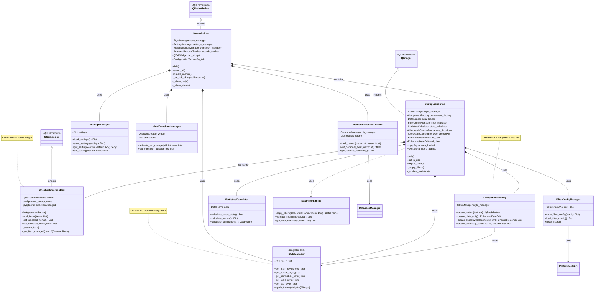

# Apple Health Monitor - Service Layer & UI Architecture

This diagram shows the service layer components, UI architecture, and their interactions.



## UI Signal Flow


## Component Lifecycle


## Service Layer Patterns

### Manager Pattern
Services that manage cross-cutting concerns:

```python
# Style Manager - Singleton-like theme management
class StyleManager:
    COLORS = {
        'primary': '#D2691E',
        'secondary': '#F4A460',
        # ...
    }
    
    @staticmethod
    def get_main_stylesheet() -> str:
        # Returns complete app stylesheet
        pass

# Settings Manager - Persistent configuration
class SettingsManager:
    def save_settings(self, settings: Dict):
        # Saves to preferences database
        pass
```

### Factory Pattern
Consistent UI component creation:

```python
class ComponentFactory:
    def create_button(self, text: str) -> QPushButton:
        button = QPushButton(text)
        button.setStyleSheet(self.style_manager.get_button_style())
        return button
```

### Strategy Pattern
Different calculation strategies:

```python
class StatisticsCalculator:
    def calculate_basic_stats(self) -> Dict:
        # Basic statistics strategy
        pass
    
    def calculate_trends(self) -> Dict:
        # Trend analysis strategy
        pass
```

### Observer Pattern
PyQt's signal/slot mechanism:

```python
class ConfigurationTab(QWidget):
    data_loaded = pyqtSignal(int)  # Emits row count
    filters_applied = pyqtSignal(dict)  # Emits filter summary
```

## Key Design Decisions

1. **Separation of Concerns**: Business logic (data processing, statistics) separated from UI
2. **Consistent Styling**: Centralized StyleManager for uniform appearance
3. **Reusable Components**: Factory pattern for UI consistency
4. **Event-Driven**: Signals/slots for loose coupling
5. **Performance**: Caching in PersonalRecordsTracker and filter results