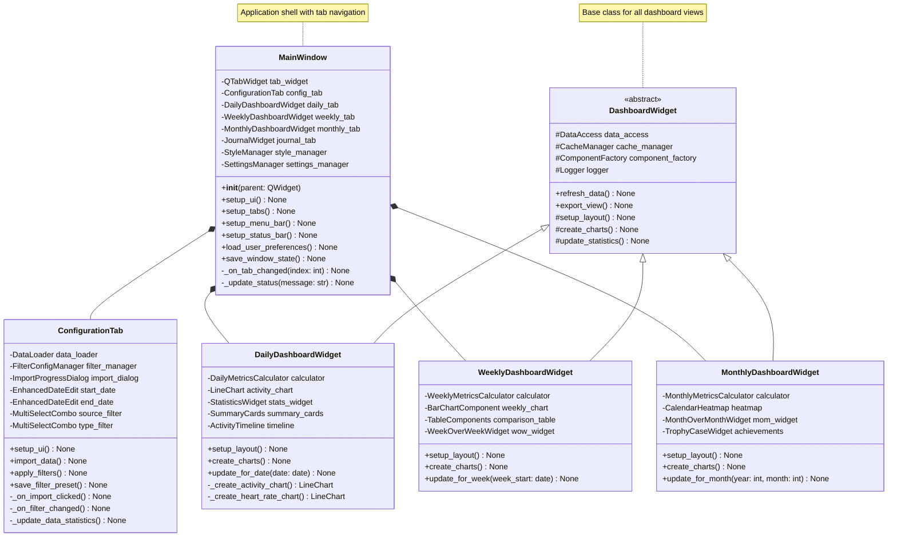
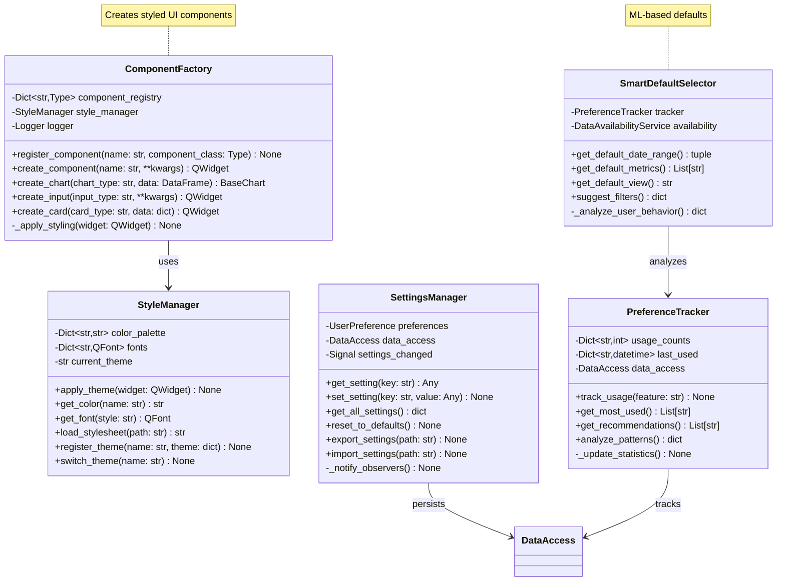
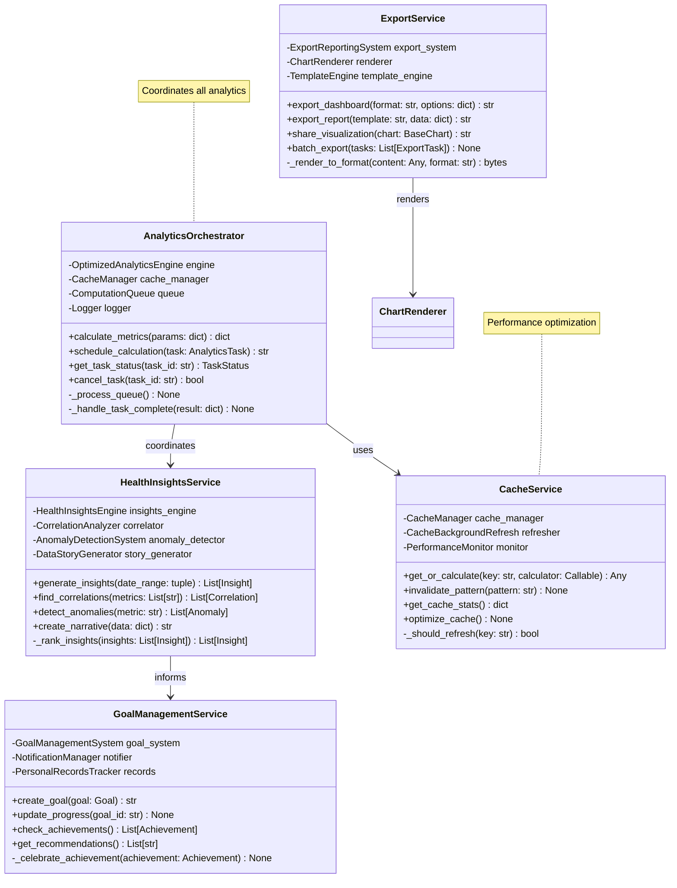
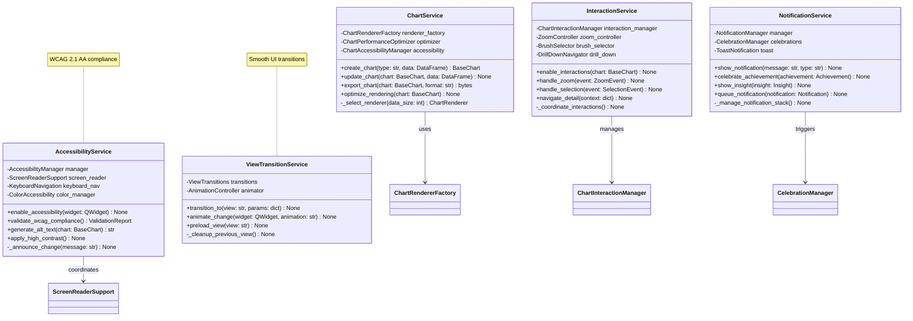
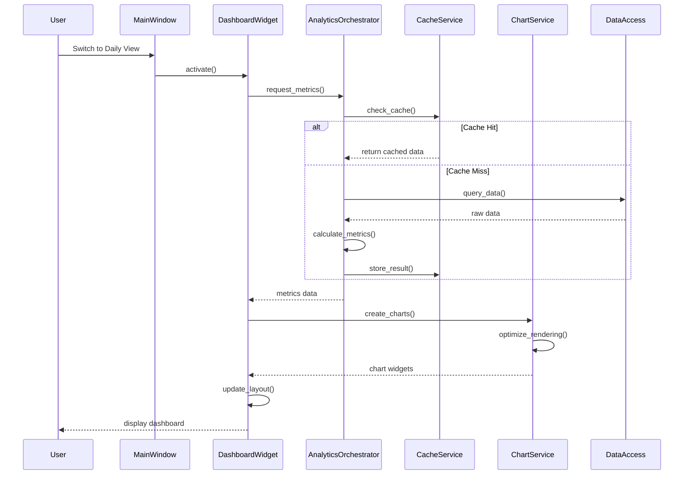
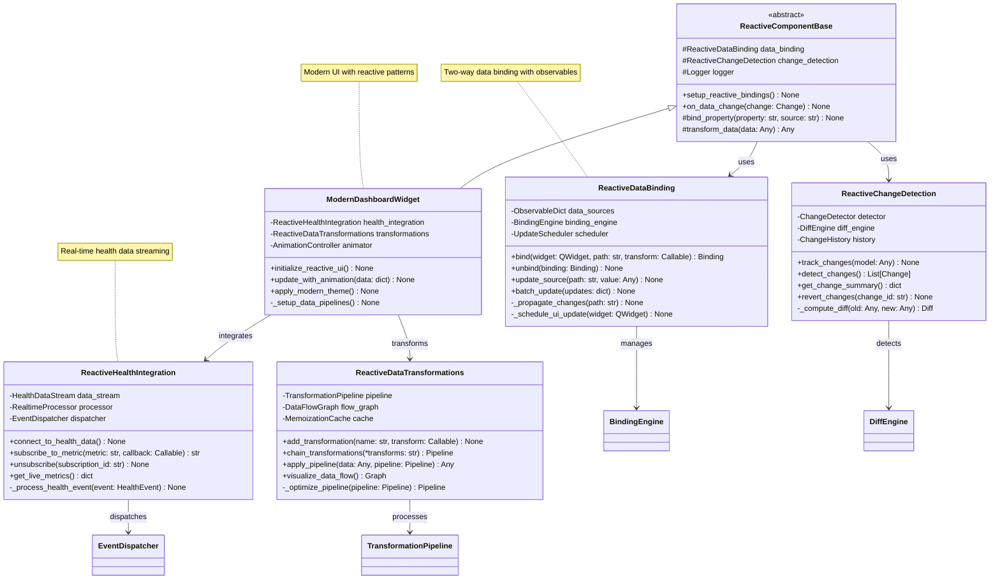
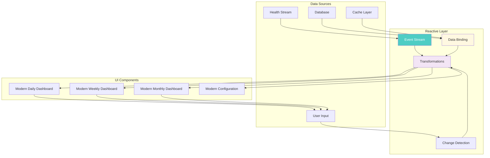

# Service Layer Architecture

This document illustrates the service layer architecture, UI components, and their coordination in the Apple Health Monitor Dashboard.

## Main UI Architecture

## Component Factory and UI Services

## Analytics Service Layer

## UI Component Services

## Service Coordination Pattern

## Reactive UI Architecture

### Reactive Data Flow

## Key Service Layer Patterns

### Dependency Injection
- Services receive dependencies through constructors
- Promotes testability and loose coupling

### Observer Pattern
- Settings changes notify all observers
- Real-time UI updates on data changes

### Command Pattern
- Analytics tasks queued as commands
- Supports undo/redo for user actions

### Facade Pattern
- High-level service interfaces hide complexity
- Simplified API for UI components

### Strategy Pattern
- Pluggable renderers and calculators
- Runtime algorithm selection based on context

### Reactive Patterns
- Observable data sources with automatic UI updates
- Immutable state management with change detection
- Declarative data transformations and pipelines
- Event-driven architecture with stream processing