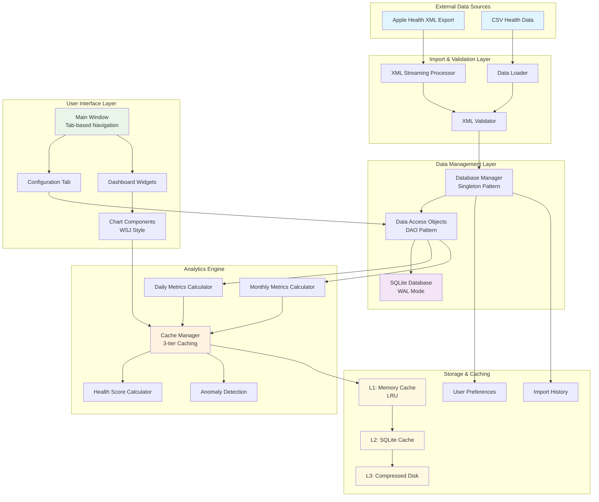
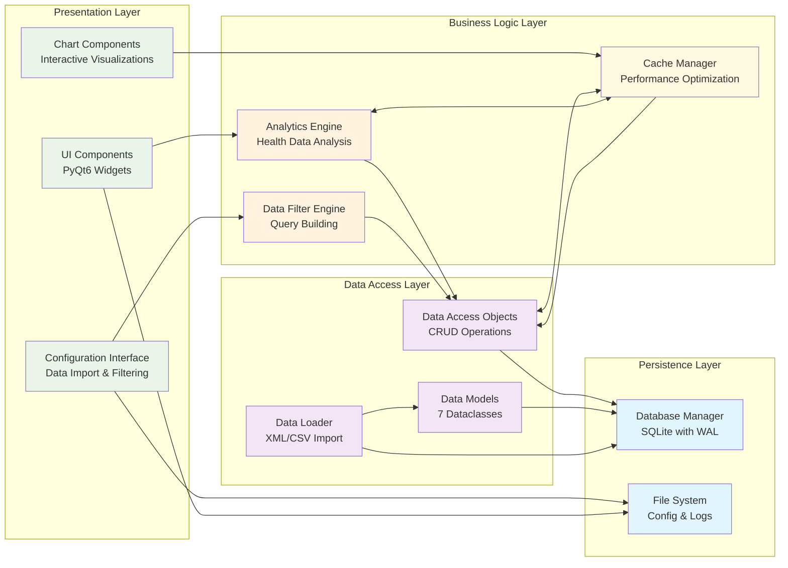
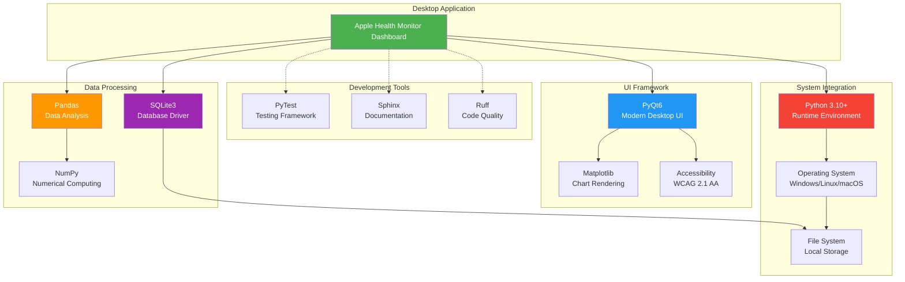

# Apple Health Monitor Dashboard - System Context Diagram

This diagram shows the high-level architecture of the Apple Health Monitor Dashboard, including external integrations, major system components, and primary data flows.

## System Context

```mermaid
C4Context
    title System Context - Apple Health Monitor Dashboard

    Person(user, "User", "Health data analyst wanting to track and visualize personal health metrics")
    
    System_Boundary(app, "Apple Health Monitor Dashboard") {
        System(ui, "User Interface Layer", "PyQt6-based desktop application with accessibility support")
        System(analytics, "Analytics Engine", "Health data analysis, trending, and scoring")
        System(data, "Data Management", "Import, storage, and access layer")
    }
    
    System_Ext(apple_health, "Apple Health App", "iOS health data export (XML format)")
    System_Ext(csv_data, "CSV Files", "External health data sources")
    System_Ext(sqlite, "SQLite Database", "Local health data storage")
    System_Ext(filesystem, "File System", "Configuration, logs, and cache storage")
    
    Rel(user, ui, "Interacts with", "Mouse, keyboard, accessibility tools")
    Rel(ui, analytics, "Requests analysis", "Qt signals/slots")
    Rel(analytics, data, "Queries data", "DAO pattern")
    Rel(data, sqlite, "Stores/retrieves", "SQL queries")
    Rel(data, apple_health, "Imports from", "XML parsing")
    Rel(data, csv_data, "Imports from", "CSV parsing")
    Rel(app, filesystem, "Reads/writes", "Config, logs, cache files")
    
    UpdateLayoutConfig($c4ShapeInRow="3", $c4BoundaryInRow="1")
```

## Primary Data Flow



## Component Interactions



## Technology Stack Context



## Key Architectural Principles

1. **Layered Architecture**: Clear separation between presentation, business logic, data access, and persistence layers
2. **Singleton Pattern**: Database manager ensures single connection point with connection pooling
3. **DAO Pattern**: Data access objects provide clean abstraction over database operations
4. **Protocol-Based Design**: Interfaces enable flexibility and testability
5. **3-Tier Caching**: Performance optimization through memory, SQLite, and disk caching
6. **Observer Pattern**: Qt signals/slots enable reactive UI updates
7. **Factory Pattern**: Component factories ensure consistent styling and behavior
8. **Local-First**: All data remains on user's machine for privacy and security

## Security & Privacy Features

- **Local Data Only**: No cloud storage or external data transmission
- **Input Validation**: Comprehensive XML and data validation
- **Secure File Handling**: Proper permissions and path validation
- **Error Isolation**: Secure error messages without data leakage
- **Database Integrity**: Foreign key constraints and transaction safety