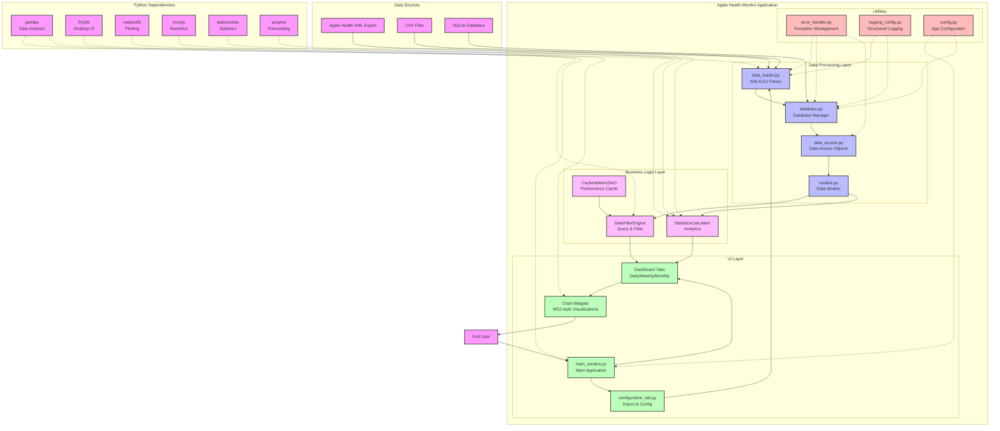

# Apple Health Monitor - System Context Diagram

This diagram shows the high-level architecture of the Apple Health Monitor application, including external dependencies, data sources, and major component interactions.

## Component Overview

### Data Sources
- **Apple Health XML Export**: Primary data source containing all health metrics
- **CSV Files**: Alternative import format for specific metrics
- **SQLite Database**: Processed and indexed data storage

### Data Processing Layer
- **data_loader.py**: Handles XML/CSV parsing and SQLite conversion
- **database.py**: Manages database connections with singleton pattern
- **data_access.py**: Provides DAOs for each entity type
- **models.py**: Defines data structures and schemas

### Business Logic Layer
- **DataFilterEngine**: Complex query building and data filtering
- **StatisticsCalculator**: Computes health metrics and trends
- **CachedMetricDAO**: Performance optimization through caching

### UI Layer
- **main_window.py**: Main application window and navigation
- **configuration_tab.py**: Data import and filter configuration
- **Dashboard Tabs**: Daily, weekly, and monthly health views
- **Chart Widgets**: WSJ-style data visualizations

### Utilities
- **error_handler.py**: Centralized exception handling
- **logging_config.py**: Structured logging with rotation
- **config.py**: Application-wide configuration

### External Dependencies
Key libraries that power the application:
- **pandas**: DataFrame operations and data analysis
- **PyQt6**: Cross-platform desktop UI framework
- **matplotlib**: Scientific plotting and charting
- **numpy**: Numerical computations
- **statsmodels**: Statistical modeling
- **prophet**: Time series forecasting