# System Context & Data Flow

This document illustrates the high-level system context and data flow for the Apple Health Monitor Dashboard application.

## System Context Diagram

```mermaid
flowchart TB
    %% External entities
    User[👤 User<br/>Health Data Owner]
    AppleHealth[📱 Apple Health App<br/>XML Export]
    FileSystem[💾 File System<br/>Local Storage]
    
    %% Main system
    System[Apple Health Monitor Dashboard<br/>PyQt6 Desktop Application]
    
    %% Data stores
    SQLite[(SQLite Database<br/>Journal & Cache)]
    
    %% User interactions
    User -->|Exports health data| AppleHealth
    AppleHealth -->|XML file| FileSystem
    User -->|Imports XML| System
    User -->|Views dashboards| System
    User -->|Writes journal| System
    
    %% System interactions
    System -->|Reads XML| FileSystem
    System -->|Stores/Retrieves| SQLite
    System -->|Exports reports| FileSystem
    
    %% Styling
    style System fill:#4ecdc4,color:#fff
    style SQLite fill:#f3e5f5
    style User fill:#e8f5e8
    style AppleHealth fill:#e1f5fe
    style FileSystem fill:#fff8e1
```

## Detailed Data Flow

## Component Interactions

## Key Design Decisions

### Data Processing Strategy
- **Streaming for large files**: XML files can exceed 100MB
- **Hybrid approach**: Memory for performance, streaming for scalability
- **Progressive loading**: UI remains responsive during imports

### Caching Architecture
- **Multi-level caching**: Memory (LRU) + SQLite for persistence
- **Metric-based keys**: Cache by metric type, date range, and filters
- **Background refresh**: Keep frequently accessed data fresh

### Security & Privacy
- **Local-only processing**: No cloud connectivity
- **Data stays on device**: All processing happens locally
- **Secure storage**: Journal entries encrypted in SQLite

### Performance Optimizations
- **Lazy loading**: Calculate metrics on-demand
- **Batch processing**: Group similar calculations
- **Concurrent analytics**: Parallel calculation of independent metrics