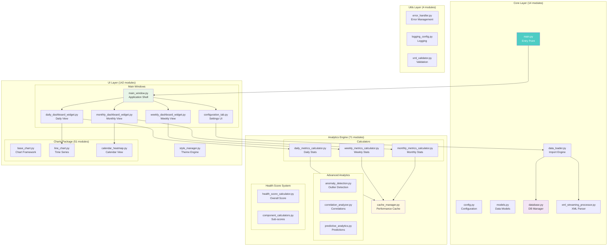
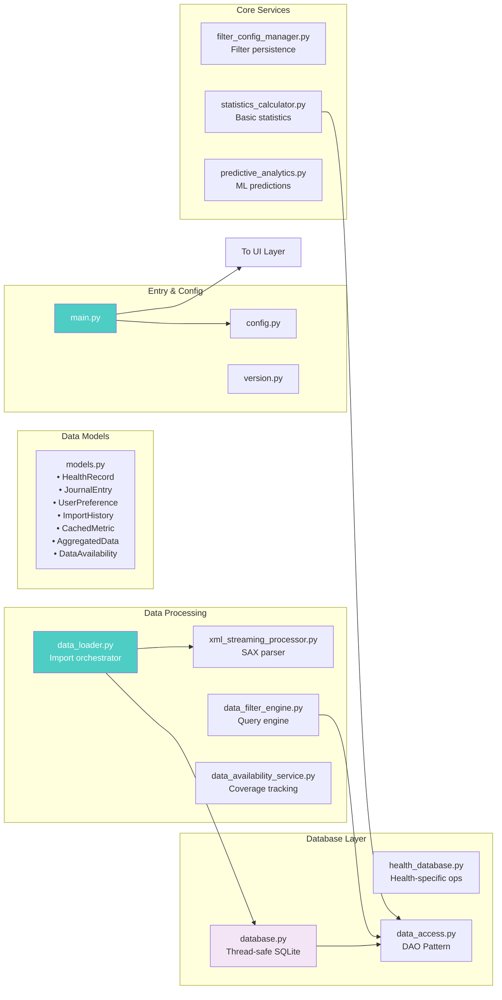
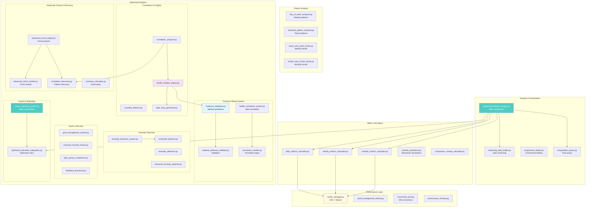
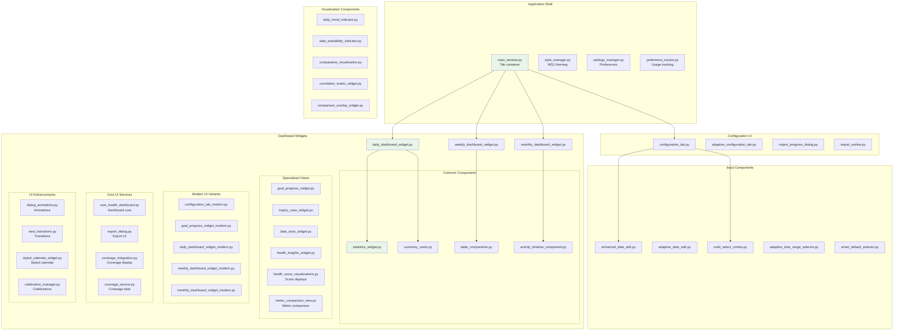

# Module Overview

This document provides a comprehensive overview of the 232 Python modules in the Apple Health Monitor Dashboard, organized by their architectural layers and relationships.

## High-Level Module Architecture

## Detailed Module Breakdown by Package

### Core Layer Structure

### Analytics Engine Architecture

### UI Layer Components

### Charts Subsystem (66 modules)

```mermaid
flowchart TB
    subgraph "Chart Infrastructure"
        BASE[base_chart.py<br/>Abstract base]
        ENH_BASE[enhanced_base_chart.py<br/>Extended features]
        CONFIG[chart_config.py<br/>Configuration]
        FACTORY_MPL[matplotlib_chart_factory.py]
        FACTORY_PQG[pyqtgraph_chart_factory.py]
        RENDER_FACTORY[chart_renderer_factory.py]
        QPAINTER[qpainter_chart_widget.py<br/>QPainter rendering]
    end
    
    subgraph "Chart Types"
        LINE[line_chart.py<br/>Time series]
        ENH_LINE[enhanced_line_chart.py<br/>Interactive]
        BAR[../bar_chart_component.py]
        HEATMAP[calendar_heatmap.py<br/>Monthly view]
        WATERFALL[waterfall_chart.py<br/>Changes]
        STREAM[stream_graph.py<br/>Stacked area]
        BUMP[bump_chart.py<br/>Rankings]
        SMALL_MULT[small_multiples.py<br/>Grid layout]
    end
    
    subgraph "Enhancements"
        ANNOTATE[annotation_renderer.py]
        LAYOUT[annotation_layout_manager.py]
        RESPONSIVE[responsive_chart_manager.py]
        OPTIMIZE[chart_performance_optimizer.py]
        ACCESS[chart_accessibility_manager.py]
        ADAPTIVE[adaptive_chart_renderer.py<br/>Adaptive rendering]
        ANNOTATED_WID[annotated_chart_widget.py<br/>Annotation support]
        ANNOT_INT[annotation_integration.py<br/>Annotation system]
        OPT_STRUCT[optimized_data_structures.py<br/>Data structures]
        OPT_LINE[optimized_line_chart.py<br/>Optimized charts]
        REACTIVE_ENH[reactive_chart_enhancements.py<br/>Reactive features]
        VIZ_PERF[visualization_performance_optimizer.py]
    end
    
    subgraph "Export System"
        EXPORT_MGR[wsj_export_manager.py]
        IMG_EXPORT[image_exporter.py]
        PDF_EXPORT[pdf_export_thread.py]
        HTML_BUILD[html_export_builder.py]
        DATA_EXPORT[data_exporter.py]
        SHARE[share_manager.py]
    end
    
    subgraph "Interactions"
        INTERACT[chart_interaction_manager.py]
        ZOOM[zoom_controller.py]
        BRUSH[brush_selector.py]
        TOOLTIP[wsj_tooltip.py]
        KEYBOARD[keyboard_navigation.py]
        DRILL[drill_down_navigator.py]
        PROG_DRILL[progressive_drill_down.py<br/>Progressive detail]
        CROSSFILTER[crossfilter_manager.py<br/>Cross-filtering]
        PERF_MON_INT[performance_monitor.py<br/>Interaction perf]
    end
    
    subgraph "Advanced Visualizations"
        TREND_VIZ[trend_visualization.py<br/>Trend displays]
        WSJ_SUITE[wsj_health_visualization_suite.py<br/>WSJ style suite]
        WSJ_STYLE[wsj_style_manager.py<br/>WSJ theming]
        SHARE_DASH[shareable_dashboard.py<br/>Sharing support]
        VIZ_EXAMPLE[visualization_example.py<br/>Demo views]
    end
    
    BASE --> LINE
    BASE --> HEATMAP
    ENH_BASE --> ENH_LINE
    
    LINE --> ANNOTATE
    ENH_LINE --> INTERACT
    INTERACT --> ZOOM
    INTERACT --> BRUSH
    
    style BASE fill:#e8f5e8
    style EXPORT_MGR fill:#4ecdc4,color:#fff
    style INTERACT fill:#e8f5e8
```

### Module Statistics Summary

| Package | Module Count | Key Responsibilities |
|---------|--------------|---------------------|
| Core | 14 | Entry point, data models, database, data loading |
| Analytics | 71 | Metrics calculation, anomaly detection, insights |
| └─ Health Score | 6 | Health scoring subsystem |
| └─ Evidence System | 4 | Medical evidence validation |
| └─ Advanced Trends | 4 | Trend analysis and discovery |
| └─ Export/Reporting | 2 | Report generation system |
| UI | 142 | User interface components and widgets |
| └─ Charts | 66 | Visualization components |
| └─ Dashboards | 8 | Dashboard management |
| └─ Accessibility | 9 | WCAG compliance |
| └─ Reactive UI | 4 | Reactive data binding system |
| Utils | 4 | Error handling, logging, validation |
| **Total** | **232** | Complete health monitoring application |

## Key Integration Points

1. **Data Pipeline**: `main.py` → `data_loader.py` → `xml_streaming_processor.py` → `database.py`
2. **Analytics Flow**: `database.py` → calculators → `cache_manager.py` → UI widgets
3. **UI Updates**: Analytics results → dashboard widgets → chart components → user display
4. **Performance**: All analytics use `cache_manager.py` and `connection_pool.py`
5. **Consistency**: `style_manager.py` ensures uniform theming across all UI components