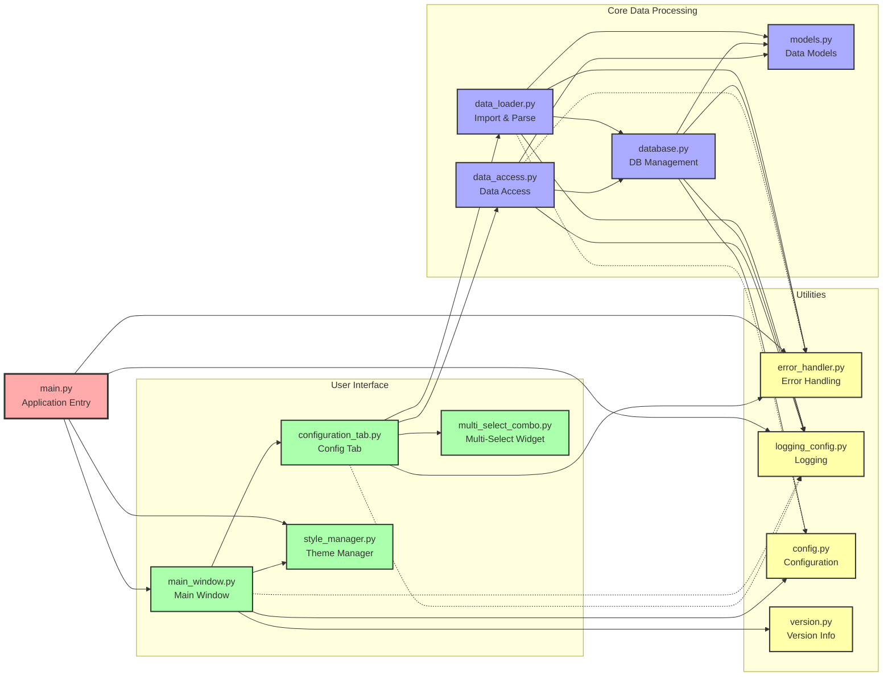
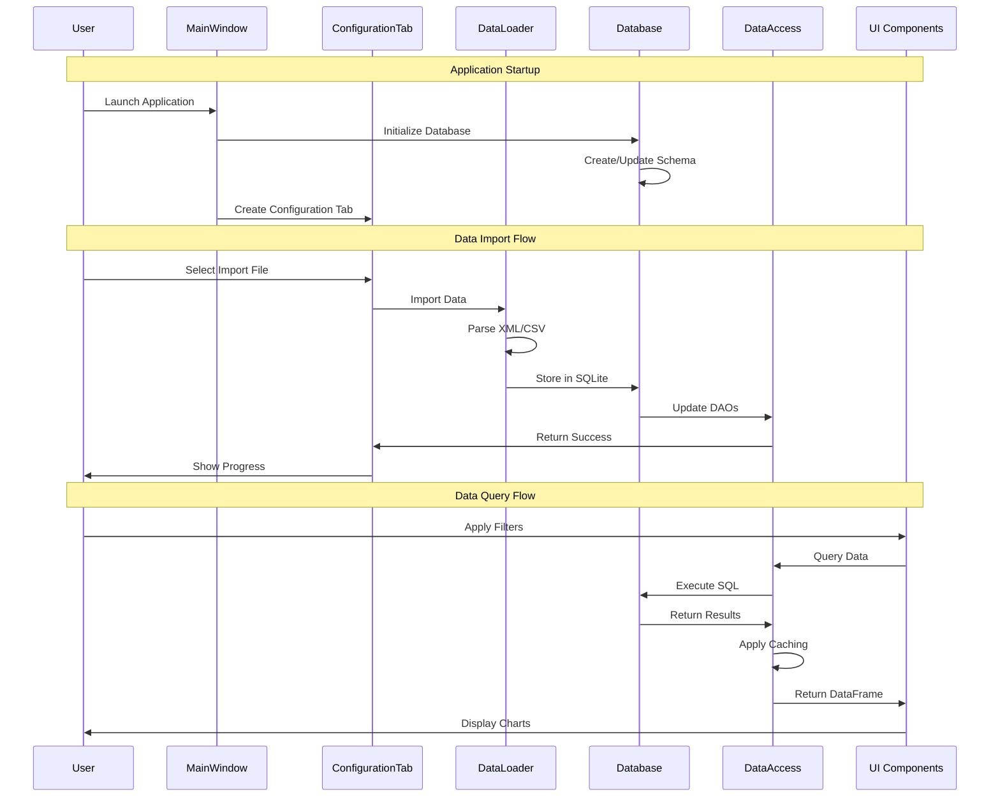

# Apple Health Monitor - Module Overview

This diagram shows the detailed relationships between modules, their dependencies, and data flow patterns.

## Module Interaction Patterns

## Key Design Patterns

### 1. Singleton Pattern
- **Database Manager**: Ensures single database connection
- **Style Manager**: Consistent theme application

### 2. Data Access Object (DAO) Pattern
- Separate DAO for each entity type
- Abstracts database operations
- Provides caching layer

### 3. Observer Pattern
- PyQt signals/slots for UI updates
- Event-driven architecture

### 4. Decorator Pattern
- Error handling decorators
- Logging decorators
- Performance monitoring

### 5. Context Manager Pattern
- Database connections
- File operations
- Error contexts

## Module Responsibilities

### Core Modules

| Module | Primary Responsibility | Key Functions |
|--------|----------------------|---------------|
| data_loader.py | Data import and conversion | parse_xml(), import_to_sqlite(), query_data() |
| database.py | Database lifecycle management | initialize(), get_connection(), execute_query() |
| data_access.py | Entity-specific data operations | get_all(), get_by_id(), save(), delete() |
| models.py | Data structure definitions | Model classes with validation |

### UI Modules

| Module | Primary Responsibility | Key Functions |
|--------|----------------------|---------------|
| main_window.py | Application shell and navigation | Setup tabs, handle navigation, manage state |
| configuration_tab.py | Import and filter configuration | Import data, configure filters, manage preferences |
| style_manager.py | Visual theme management | Apply warm theme, manage colors |
| multi_select_combo.py | Enhanced dropdown widget | Multi-selection, keyboard navigation |

### Utility Modules

| Module | Primary Responsibility | Key Functions |
|--------|----------------------|---------------|
| error_handler.py | Exception management | Custom exceptions, decorators, context managers |
| logging_config.py | Application logging | Setup loggers, rotation, formatting |
| config.py | Central configuration | Constants, paths, limits |
| version.py | Version tracking | Version string, build info |