# Apple Health Monitor Dashboard - Module Overview

This diagram shows the detailed relationships between modules across all layers, their dependencies, and data flow patterns throughout the entire application.

## Complete Module Architecture

```mermaid
flowchart TD
    %% Entry Point
    MAIN[main.py<br/>🚀 Application Entry]

    %% Core Infrastructure
    subgraph "Core Infrastructure Layer"
        direction LR
        DB[database.py<br/>🗄️ DB Manager<br/>Singleton]
        DA[data_access.py<br/>📋 DAO Pattern<br/>7 DAOs]
        MOD[models.py<br/>📊 Data Models<br/>7 Dataclasses]
        DL[data_loader.py<br/>📥 XML/CSV Import<br/>Streaming]
        CFG[config.py<br/>⚙️ Configuration<br/>Constants]
    end

    %% Analytics Engine
    subgraph "Analytics Engine"
        direction TB
        DAILY[daily_metrics_calculator.py<br/>📈 Daily Analytics]
        MONTHLY[monthly_metrics_calculator.py<br/>📅 Monthly Analytics]
        CACHE[cache_manager.py<br/>⚡ 3-Tier Cache<br/>LRU/SQLite/Disk]
        STATS[statistics_calculator.py<br/>📊 Statistical Analysis]
        subgraph "Health Scoring"
            HS[health_score_calculator.py<br/>💚 Health Score]
            COMP[component_calculators.py<br/>🔢 Score Components]
            PERS[personalization_engine.py<br/>👤 Personalization]
        end
        ANOM[anomaly_detection.py<br/>🚨 Anomaly Detection]
    end

    %% UI Layer
    subgraph "User Interface Layer"
        direction TB
        MW[main_window.py<br/>🏠 Main Window<br/>Tab Navigation]
        CT[configuration_tab.py<br/>⚙️ Config Tab<br/>Import & Filter]
        
        subgraph "Dashboard Widgets"
            DAILY_DASH[daily_dashboard_widget.py<br/>📅 Daily Dashboard]
            WEEKLY_DASH[weekly_dashboard_widget.py<br/>📊 Weekly Dashboard]
            MONTHLY_DASH[monthly_dashboard_widget.py<br/>📈 Monthly Dashboard]
        end
        
        subgraph "Chart Components"
            BASE_CHART[base_chart.py<br/>📊 Chart Base]
            LINE_CHART[line_chart.py<br/>📈 Line Charts]
            CAL_HEAT[calendar_heatmap.py<br/>🗓️ Calendar Heatmap]
            ENHANCED_LINE[enhanced_line_chart.py<br/>⚡ Enhanced Line]
        end
        
        subgraph "UI Components"
            MULTI_SELECT[multi_select_combo.py<br/>☑️ Multi-Select]
            STATS_WIDGET[statistics_widget.py<br/>📊 Stats Display]
            STYLE_MGR[style_manager.py<br/>🎨 WSJ Styling]
        end
    end

    %% Utilities
    subgraph "Utilities Layer"
        direction LR
        ERR[error_handler.py<br/>⚠️ Error Handling<br/>Custom Exceptions]
        LOG[logging_config.py<br/>📝 Logging<br/>Structured + Rotation]
        XML_VAL[xml_validator.py<br/>✅ XML Validation<br/>Apple Health]
        VER[version.py<br/>🔖 Version Info]
    end

    %% External Dependencies
    subgraph "External Libraries"
        direction LR
        PYQT[PyQt6<br/>🖥️ Desktop UI]
        PANDAS[Pandas<br/>🐼 Data Analysis]
        SQLITE[SQLite<br/>🗄️ Database]
        MPL[Matplotlib<br/>📊 Plotting]
        NUMPY[NumPy<br/>🔢 Numerics]
    end

    %% Primary Dependencies (solid lines)
    MAIN --> MW
    MAIN --> LOG
    MAIN --> ERR
    
    MW --> CT
    MW --> DAILY_DASH
    MW --> WEEKLY_DASH
    MW --> MONTHLY_DASH
    MW --> STYLE_MGR
    
    CT --> DL
    CT --> DA
    CT --> MULTI_SELECT
    
    DAILY_DASH --> DAILY
    WEEKLY_DASH --> STATS
    MONTHLY_DASH --> MONTHLY
    
    DAILY_DASH --> LINE_CHART
    WEEKLY_DASH --> ENHANCED_LINE
    MONTHLY_DASH --> CAL_HEAT
    
    LINE_CHART --> BASE_CHART
    ENHANCED_LINE --> BASE_CHART
    CAL_HEAT --> BASE_CHART
    
    DAILY --> DA
    MONTHLY --> DA
    STATS --> DA
    CACHE --> DA
    
    HS --> COMP
    HS --> PERS
    ANOM --> STATS
    
    DA --> DB
    DA --> MOD
    DL --> DB
    DL --> MOD
    
    DAILY --> CACHE
    MONTHLY --> CACHE
    STATS --> CACHE
    
    %% Cross-cutting concerns (dashed lines)
    ERR -.-> DL
    ERR -.-> DB
    ERR -.-> DA
    ERR -.-> MW
    
    LOG -.-> DL
    LOG -.-> DB
    LOG -.-> MW
    LOG -.-> DAILY
    LOG -.-> MONTHLY
    
    CFG -.-> DB
    CFG -.-> MW
    CFG -.-> DL
    
    XML_VAL -.-> DL
    
    %% External library usage (dotted lines)
    MW -.-> PYQT
    BASE_CHART -.-> MPL
    DA -.-> PANDAS
    DB -.-> SQLITE
    STATS -.-> NUMPY
    DL -.-> PANDAS
    
    %% Styling
    style MAIN fill:#ff6b6b,color:#fff,stroke:#333,stroke-width:3px
    style DB fill:#4ecdc4,color:#fff,stroke:#333,stroke-width:2px
    style CACHE fill:#ffe66d,color:#333,stroke:#333,stroke-width:2px
    style MW fill:#a8e6cf,color:#333,stroke:#333,stroke-width:2px
    style DAILY fill:#ff8b94,color:#fff,stroke:#333,stroke-width:2px
    style MONTHLY fill:#ff8b94,color:#fff,stroke:#333,stroke-width:2px
    style HS fill:#c7ceea,color:#333,stroke:#333,stroke-width:2px
```



## Analytics Module Relationships

```mermaid
flowchart LR
    subgraph "Data Sources"
        DAO[Data Access Objects<br/>📋 CRUD Operations]
        CACHE_DB[Cached Data<br/>⚡ Performance Layer]
    end
    
    subgraph "Calculator Layer"
        DAILY_CALC[DailyMetricsCalculator<br/>📅 Daily Analysis]
        WEEKLY_CALC[WeeklyMetricsCalculator<br/>📊 Weekly Analysis]
        MONTHLY_CALC[MonthlyMetricsCalculator<br/>📈 Monthly Analysis]
        STATS_CALC[StatisticsCalculator<br/>📊 Statistical Analysis]
    end
    
    subgraph "Analysis Services"
        COMP_ANALYTICS[ComparativeAnalytics<br/>🔄 Comparisons]
        ANOM_DETECT[AnomalyDetection<br/>🚨 Outlier Detection]
        TREND_ANALYZER[TrendAnalyzer<br/>📈 Trend Analysis]
        CORR_ANALYZER[CorrelationAnalyzer<br/>🔗 Correlations]
    end
    
    subgraph "Health Scoring System"
        HEALTH_SCORE[HealthScoreCalculator<br/>💚 Overall Score]
        COMPONENT_CALC[ComponentCalculators<br/>🔢 Score Components]
        PERSONAL_ENGINE[PersonalizationEngine<br/>👤 User Adaptation]
    end
    
    subgraph "Caching & Performance"
        CACHE_MGR[CacheManager<br/>⚡ 3-Tier Caching]
        CACHED_CALC[CachedCalculators<br/>📊 Cached Analytics]
        BG_REFRESH[BackgroundRefresh<br/>🔄 Cache Warming]
    end
    
    %% Data flow
    DAO --> DAILY_CALC
    DAO --> WEEKLY_CALC
    DAO --> MONTHLY_CALC
    DAO --> STATS_CALC
    
    CACHE_DB --> DAILY_CALC
    CACHE_DB --> WEEKLY_CALC
    CACHE_DB --> MONTHLY_CALC
    
    %% Analytics processing
    DAILY_CALC --> COMP_ANALYTICS
    WEEKLY_CALC --> COMP_ANALYTICS
    MONTHLY_CALC --> COMP_ANALYTICS
    
    STATS_CALC --> ANOM_DETECT
    STATS_CALC --> TREND_ANALYZER
    STATS_CALC --> CORR_ANALYZER
    
    %% Health scoring
    DAILY_CALC --> COMPONENT_CALC
    WEEKLY_CALC --> COMPONENT_CALC
    MONTHLY_CALC --> COMPONENT_CALC
    
    COMPONENT_CALC --> HEALTH_SCORE
    PERSONAL_ENGINE --> HEALTH_SCORE
    TREND_ANALYZER --> HEALTH_SCORE
    
    %% Caching layer
    DAILY_CALC --> CACHE_MGR
    WEEKLY_CALC --> CACHE_MGR
    MONTHLY_CALC --> CACHE_MGR
    STATS_CALC --> CACHE_MGR
    
    CACHE_MGR --> CACHED_CALC
    BG_REFRESH --> CACHE_MGR
    
    %% Performance optimization
    CACHED_CALC --> COMP_ANALYTICS
    CACHED_CALC --> HEALTH_SCORE
    
    %% Styling
    style DAO fill:#e8f4f8
    style CACHE_DB fill:#fff8dc
    style DAILY_CALC fill:#e8f8e8
    style HEALTH_SCORE fill:#f0e8ff
    style CACHE_MGR fill:#fff0e8
```



## UI Component Hierarchy

```mermaid
flowchart TD
    subgraph "Main Application Shell"
        MW[MainWindow<br/>🏠 QMainWindow<br/>Tab Navigation]
    end
    
    subgraph "Primary Tabs"
        CONFIG_TAB[ConfigurationTab<br/>⚙️ Data Import & Filters]
        DAILY_TAB[DailyDashboardWidget<br/>📅 Daily Analysis]
        WEEKLY_TAB[WeeklyDashboardWidget<br/>📊 Weekly Analysis] 
        MONTHLY_TAB[MonthlyDashboardWidget<br/>📈 Monthly Analysis]
    end
    
    subgraph "Chart System"
        CHART_FACTORY[ComponentFactory<br/>🏭 Chart Creation]
        BASE_CHART[BaseChart<br/>📊 Abstract Base]
        LINE_CHART[LineChart<br/>📈 Basic Line]
        ENHANCED_LINE[EnhancedLineChart<br/>⚡ Advanced Line]
        CAL_HEATMAP[CalendarHeatmap<br/>🗓️ Daily Heatmap]
        WSJ_STYLE[WSJStyleManager<br/>🎨 Professional Styling]
    end
    
    subgraph "Data Input Components"
        MULTI_SELECT[MultiSelectCombo<br/>☑️ Multi-Selection]
        DATE_EDIT[EnhancedDateEdit<br/>📅 Date Selection]
        TIME_RANGE[TimeRangeSelector<br/>⏰ Time Periods]
    end
    
    subgraph "Display Components"
        STATS_WIDGET[StatisticsWidget<br/>📊 Stats Display]
        SUMMARY_CARDS[SummaryCards<br/>📋 Key Metrics]
        TABLE_COMP[TableComponents<br/>📑 Data Tables]
        TREND_INDICATOR[TrendIndicator<br/>📈 Trend Arrows]
    end
    
    subgraph "Interactive Features"
        TOOLTIP[InteractiveTooltip<br/>💬 Rich Tooltips]
        ZOOM[ZoomController<br/>🔍 Chart Zoom]
        BRUSH[BrushSelector<br/>🖌️ Data Selection]
        DRILL_DOWN[DrillDownNavigator<br/>🎯 Detail Navigation]
    end
    
    %% Main window relationships
    MW --> CONFIG_TAB
    MW --> DAILY_TAB
    MW --> WEEKLY_TAB
    MW --> MONTHLY_TAB
    
    %% Tab content
    CONFIG_TAB --> MULTI_SELECT
    CONFIG_TAB --> DATE_EDIT
    CONFIG_TAB --> TIME_RANGE
    
    DAILY_TAB --> CHART_FACTORY
    WEEKLY_TAB --> CHART_FACTORY
    MONTHLY_TAB --> CHART_FACTORY
    
    DAILY_TAB --> STATS_WIDGET
    WEEKLY_TAB --> SUMMARY_CARDS
    MONTHLY_TAB --> TABLE_COMP
    
    %% Chart system
    CHART_FACTORY --> BASE_CHART
    BASE_CHART --> LINE_CHART
    BASE_CHART --> ENHANCED_LINE
    BASE_CHART --> CAL_HEATMAP
    
    WSJ_STYLE --> LINE_CHART
    WSJ_STYLE --> ENHANCED_LINE
    WSJ_STYLE --> CAL_HEATMAP
    
    %% Interactive features
    LINE_CHART --> TOOLTIP
    ENHANCED_LINE --> ZOOM
    ENHANCED_LINE --> BRUSH
    CAL_HEATMAP --> DRILL_DOWN
    
    STATS_WIDGET --> TREND_INDICATOR
    
    %% Styling
    style MW fill:#ff6b6b,color:#fff
    style CONFIG_TAB fill:#4ecdc4,color:#fff
    style DAILY_TAB fill:#45b7d1,color:#fff
    style WEEKLY_TAB fill:#96ceb4,color:#fff
    style MONTHLY_TAB fill:#feca57,color:#333
    style CHART_FACTORY fill:#ff9ff3,color:#333
    style WSJ_STYLE fill:#54a0ff,color:#fff
```



## Module Interaction Patterns

sequenceDiagram
    participant U as User
    participant MW as MainWindow
    participant CT as ConfigurationTab
    participant DL as DataLoader
    participant DB as Database
    participant CACHE as CacheManager
    participant ANALYTICS as Analytics
    participant DASHBOARD as Dashboard

    Note over U,DASHBOARD: Application Startup
    U->>MW: Launch Application
    MW->>DB: Initialize Database
    DB->>DB: Create/Update Schema
    MW->>CACHE: Initialize Cache System
    MW->>CT: Create Configuration Tab

    Note over U,DASHBOARD: Data Import Flow
    U->>CT: Select Import File
    CT->>DL: Import Data
    DL->>DL: Parse & Validate XML/CSV
    DL->>DB: Store in SQLite
    DB->>CACHE: Invalidate Affected Cache
    CT->>U: Show Import Progress

    Note over U,DASHBOARD: Analytics Processing Flow
    U->>DASHBOARD: Switch to Dashboard Tab
    DASHBOARD->>CACHE: Check Cache for Data
    alt Cache Hit
        CACHE->>DASHBOARD: Return Cached Results
    else Cache Miss
        CACHE->>ANALYTICS: Request Calculations
        ANALYTICS->>DB: Query Raw Data
        DB->>ANALYTICS: Return Data
        ANALYTICS->>ANALYTICS: Perform Analysis
        ANALYTICS->>CACHE: Store Results
        CACHE->>DASHBOARD: Return Results
    end
    DASHBOARD->>U: Display Visualizations

    Note over U,DASHBOARD: Real-time Filter Updates
    U->>DASHBOARD: Apply Filter
    DASHBOARD->>CACHE: Check Filtered Cache
    CACHE->>ANALYTICS: Calculate if Needed
    ANALYTICS->>CACHE: Update Cache
    CACHE->>DASHBOARD: Return Results
    DASHBOARD->>U: Update Charts
```

## Data Flow Patterns


## Key Design Patterns

### 1. Singleton Pattern
- **Database Manager**: Thread-safe singleton ensuring single connection point
- **Cache Manager**: Global cache coordination across the application
- **Style Manager**: Consistent WSJ-inspired theme application

### 2. Data Access Object (DAO) Pattern
- **7 Specialized DAOs**: One for each data entity type
- **Caching Integration**: Built-in performance optimization
- **Query Abstraction**: Clean separation of data logic from business logic

### 3. Factory Pattern
- **Component Factory**: Standardized UI component creation
- **Chart Factory**: Multiple rendering backend support
- **Calculator Factory**: Pluggable analytics engines

### 4. Protocol-Based Design
- **Data Source Protocol**: Flexible data source abstraction
- **Calculator Protocol**: Interchangeable analysis algorithms
- **Chart Protocol**: Multiple visualization backends

### 5. Observer Pattern
- **Qt Signals/Slots**: Reactive UI updates
- **Cache Invalidation**: Automatic cache refresh on data changes
- **Real-time Filtering**: Instant UI response to filter changes

### 6. Strategy Pattern
- **Caching Strategies**: LRU, SQLite, and disk-based caching
- **Chart Rendering**: Matplotlib vs PyQtGraph backends
- **Data Processing**: Streaming vs batch processing

## Module Responsibilities Summary

### 🏗️ Core Infrastructure (5 modules)
- **Database Management**: Thread-safe SQLite operations with migrations
- **Data Access Layer**: DAO pattern with 7 entity-specific classes  
- **Data Models**: Type-safe dataclasses with validation
- **Import Processing**: Streaming XML/CSV parser with validation
- **Configuration**: Centralized constants and settings

### 📊 Analytics Engine (38+ modules)
- **Metrics Calculators**: Daily, weekly, monthly statistical analysis
- **Caching System**: 3-tier performance optimization
- **Health Scoring**: Comprehensive health assessment with personalization
- **Anomaly Detection**: Statistical outlier identification
- **Trend Analysis**: Time-series analysis and forecasting

### 🎨 User Interface (85+ modules)
- **Main Application**: Tab-based navigation with accessibility
- **Dashboard Widgets**: Responsive layouts for different time periods
- **Chart Components**: WSJ-inspired visualizations with interactions
- **Input Components**: Enhanced form controls with validation
- **Styling System**: Professional design with warm color palette

### 🛠️ Utilities (3 modules)
- **Error Handling**: Comprehensive exception hierarchy with decorators
- **Logging**: Structured logging with rotation and multiple handlers
- **XML Validation**: Apple Health format validation with detailed reporting

## Performance & Architecture Highlights

- **3-Tier Caching**: Memory (LRU) → SQLite → Compressed disk
- **Streaming Processing**: Handle large XML files efficiently
- **Background Processing**: Non-blocking UI with worker threads
- **Singleton Database**: Connection pooling with transaction safety
- **Modular Design**: Clear separation of concerns across 150+ modules
- **Protocol-Based**: Flexible interfaces enabling testing and extensibility