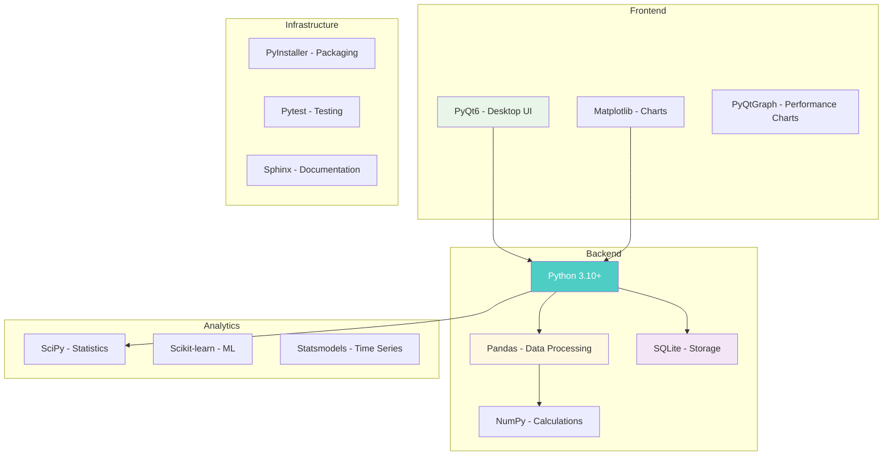
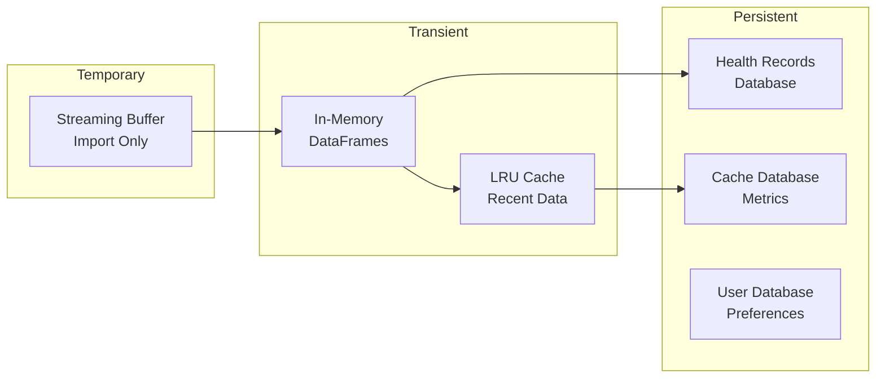
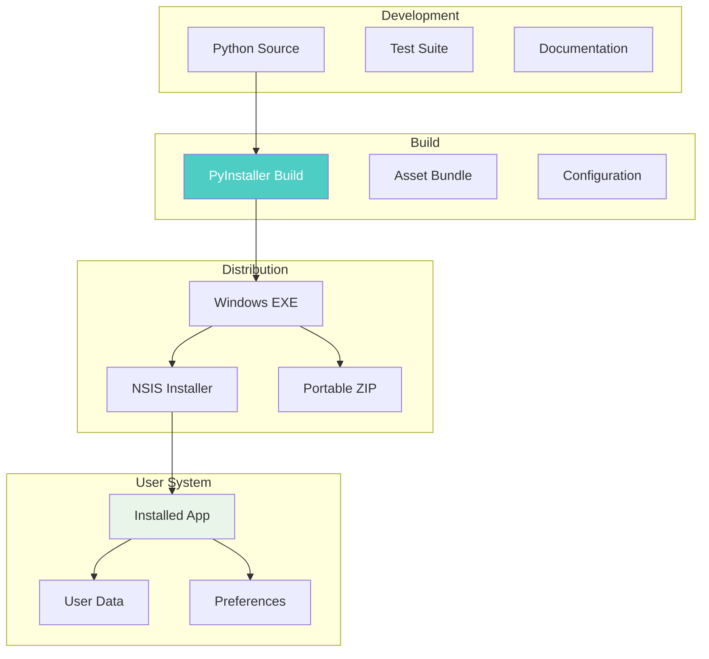

# Architecture Overview

This document provides a high-level overview of the Apple Health Monitor Dashboard architecture, design principles, and technical decisions.

## Architecture Principles

### 1. **Separation of Concerns**
- Clear boundaries between layers (UI, Service, Analytics, Core)
- Each module has a single, well-defined responsibility
- Dependencies flow downward (UI → Service → Analytics → Core)

### 2. **Data Privacy First**
- All processing happens locally on user's machine
- No cloud connectivity or external data transmission
- Sensitive health data never leaves the device

### 3. **Performance at Scale**
- Designed to handle 100MB+ XML files efficiently
- Streaming processing for memory efficiency
- Multi-level caching for responsive UI

### 4. **Extensibility**
- Plugin architecture for new chart types
- Configurable analytics pipeline
- Theme system for customization

### 5. **Accessibility**
- WCAG 2.1 AA compliance built-in
- Keyboard navigation throughout
- Screen reader support

## Technology Stack

## Data Architecture

### Data Sources
- **Primary**: Apple Health XML exports (100MB-1GB+)
- **Secondary**: Manual journal entries
- **Cached**: Pre-calculated metrics in SQLite

### Data Flow
1. **Import**: XML/CSV → Streaming Parser → Validation
2. **Storage**: Validated Data → SQLite Database
3. **Processing**: Raw Data → Analytics Engine → Metrics
4. **Caching**: Metrics → Cache Layer → Fast Retrieval
5. **Display**: Cached Data → UI Components → User

### Storage Strategy

## Security Architecture

### Data Protection
- **Local Processing**: No network requests
- **Encryption**: Journal entries encrypted at rest
- **Access Control**: File system permissions only
- **Data Validation**: Strict input validation

### Privacy Features
- **No Telemetry**: No usage tracking
- **No Cloud Sync**: All data stays local
- **Export Control**: User controls all exports
- **Data Deletion**: Complete data removal option

## Performance Architecture

### Optimization Strategies
1. **Lazy Loading**: Calculate only what's visible
2. **Caching**: Multi-level cache hierarchy
3. **Streaming**: Process large files in chunks
4. **Pooling**: Reuse database connections
5. **Batching**: Group similar operations

### Performance Targets
- **Import Speed**: 10MB/second for XML parsing
- **UI Response**: <200ms for user actions
- **Chart Render**: <500ms for complex visualizations
- **Memory Usage**: <500MB for typical usage
- **Startup Time**: <3 seconds

## Scalability Considerations

### Current Limits
- **Data Size**: Tested up to 1GB XML files
- **Record Count**: Millions of health records
- **Time Range**: 10+ years of data
- **Metrics**: 50+ health metric types

### Growth Strategy
- **Partitioning**: Date-based data partitioning
- **Indexing**: Optimized database indices
- **Archival**: Old data compression
- **Sampling**: Statistical sampling for large datasets

## Deployment Architecture

## Future Architecture Considerations

### Planned Enhancements
1. **Plugin System**: User-installable analytics plugins
2. **Theme Engine**: Complete UI theming support
3. **Export Templates**: Customizable report templates
4. **Automation**: Scheduled imports and reports

### Potential Expansions
1. **Multi-Platform**: macOS and Linux support
2. **Mobile Companion**: View-only mobile app
3. **Health Device Integration**: Direct device imports
4. **Advanced ML**: Predictive health insights

## Architecture Decision Records (ADRs)

Key architectural decisions are documented in the `.simone/05_ARCHITECTURE_DECISIONS/` directory. Major decisions include:

1. **PyQt6 over Electron**: Native performance for large datasets
2. **SQLite over PostgreSQL**: Zero-configuration deployment
3. **Local-only processing**: Privacy and security first
4. **Streaming XML parsing**: Memory efficiency for large files
5. **Multi-level caching**: Balance between memory and speed

---

*This overview provides the foundation for understanding the Apple Health Monitor Dashboard architecture. For detailed implementation specifics, refer to the other architecture documents.*