# Journal Feature Architecture Diagrams

## Overview

This document contains Mermaid diagrams illustrating the architecture of the journal feature in the Apple Health Monitor application.

## Component Architecture

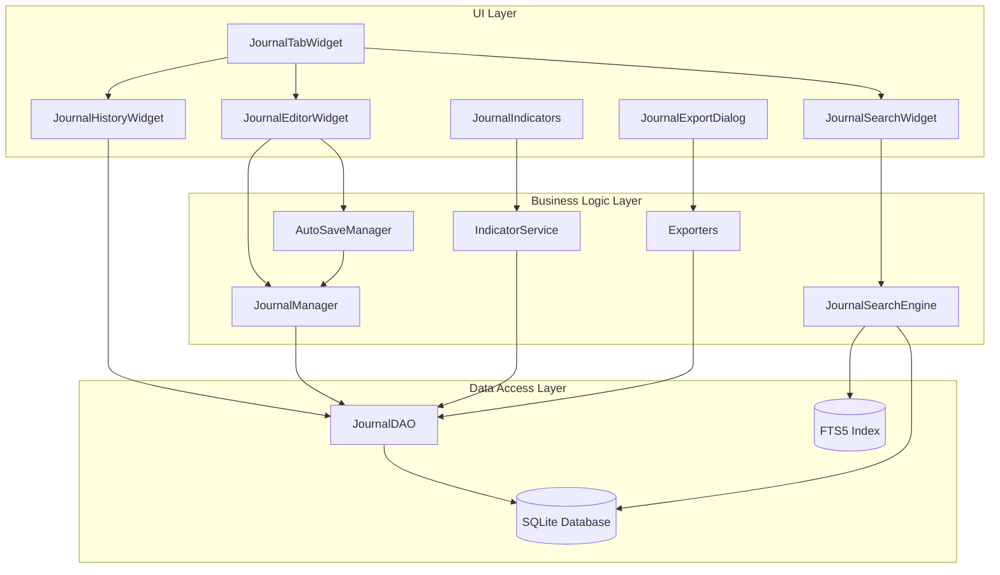

## Data Flow Diagram

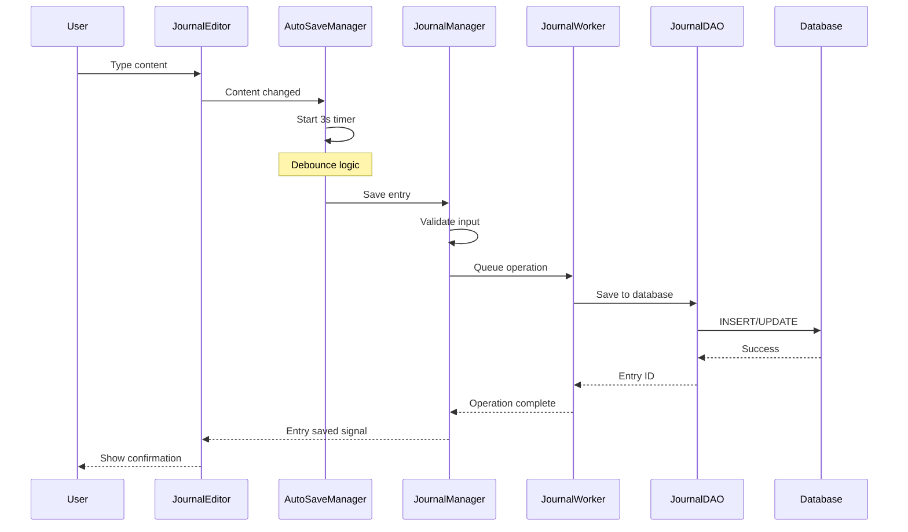

## Search System Architecture

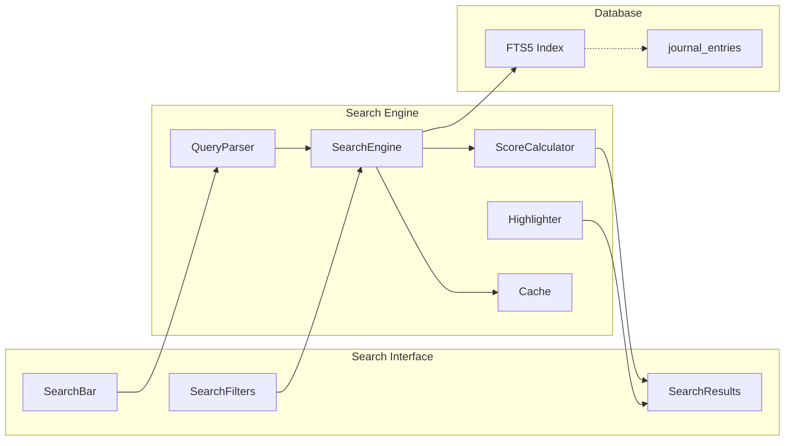

## State Management

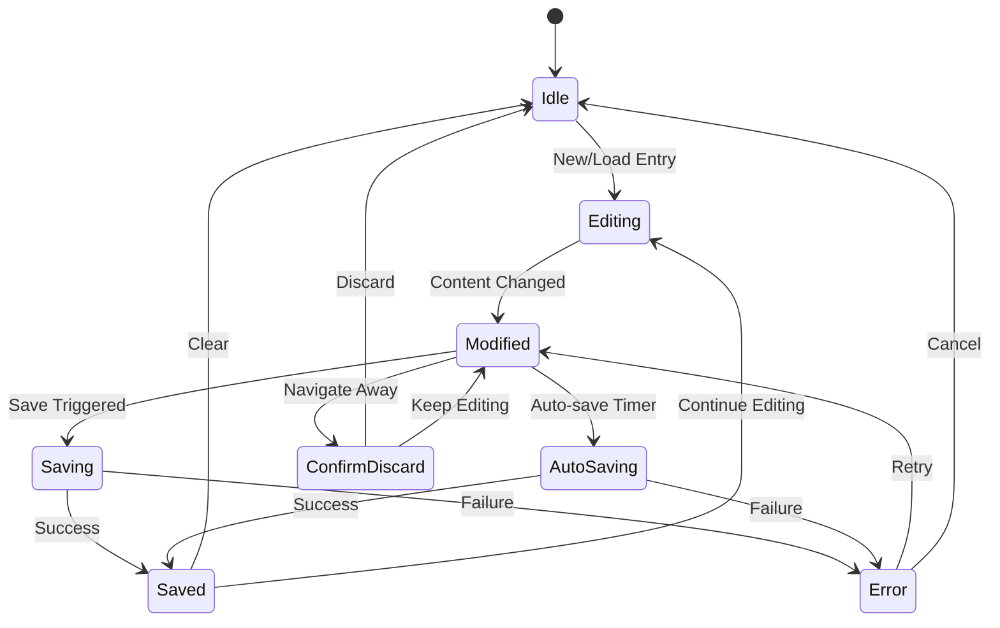

## Export System Flow

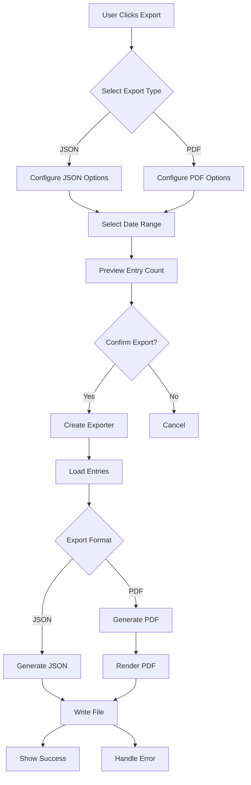

## Journal Entry Types

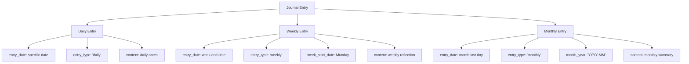

## Database Schema

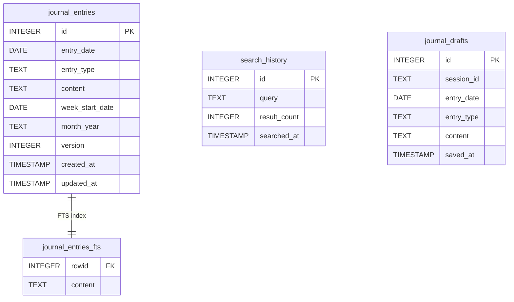

## Signal Flow

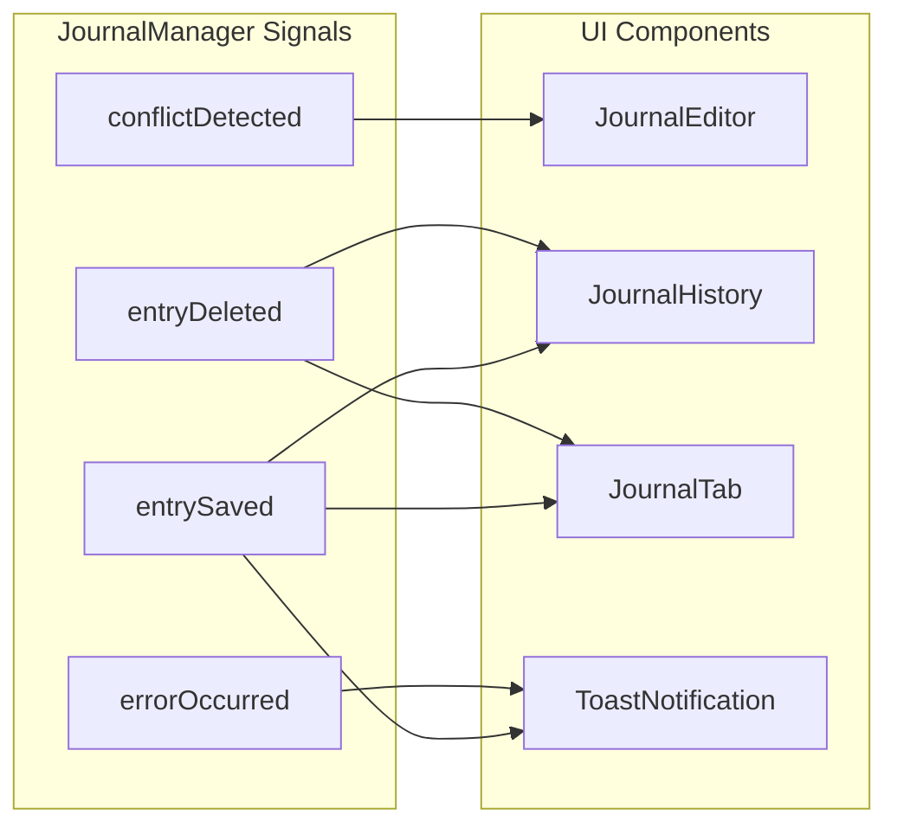

## Thread Architecture

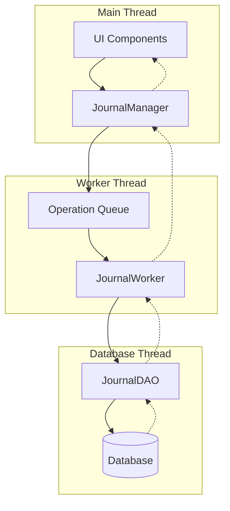

## Performance Optimization

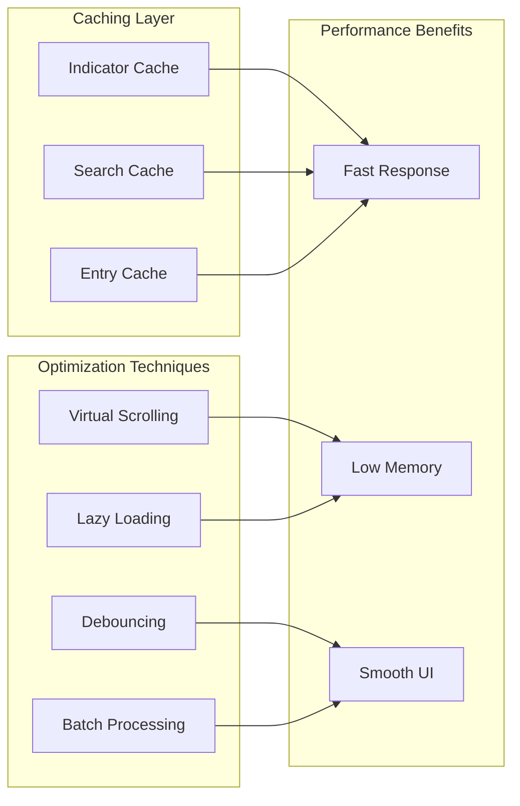

## Integration Points

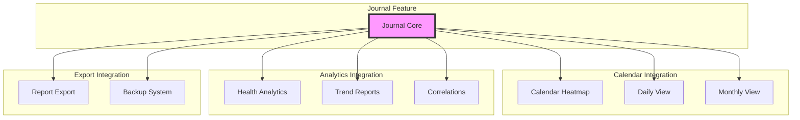