# Troubleshooting Flowcharts - Apple Health Monitor Dashboard

Visual guides for resolving common issues with the Apple Health Monitor Dashboard.

---

## Installation Issues Flowchart

```mermaid
graph TD
    Start[Installation Problem] --> Check{What's the issue?}
    
    Check -->|Won't download| Download[Download Issues]
    Check -->|Security warning| Security[Security Warnings]
    Check -->|Installation fails| Install[Installation Failure]
    Check -->|Missing dependencies| Deps[Dependencies]
    
    Download --> Size{File size correct?}
    Size -->|No| Redownload[Clear cache & redownload]
    Size -->|Yes| Browser[Try different browser]
    
    Security --> SmartScreen{Windows SmartScreen?}
    SmartScreen -->|Yes| MoreInfo[Click 'More info' → 'Run anyway']
    SmartScreen -->|No| Antivirus{Antivirus blocking?}
    Antivirus -->|Yes| Whitelist[Add to antivirus exceptions]
    Antivirus -->|No| Unblock[Right-click → Properties → Unblock]
    
    Install --> Admin{Run as admin?}
    Admin -->|No| RunAdmin[Right-click → Run as administrator]
    Admin -->|Yes| Space{Disk space OK?}
    Space -->|No| FreeSpace[Free up space (need 500MB)]
    Space -->|Yes| Conflict{Other software running?}
    Conflict -->|Yes| SafeMode[Restart in Safe Mode & install]
    Conflict -->|No| Portable[Try portable version]
    
    Deps --> VCCheck{VCRUNTIME error?}
    VCCheck -->|Yes| VCInstall[Install Visual C++ Redistributables]
    VCCheck -->|No| NetCheck{.NET error?}
    NetCheck -->|Yes| NetInstall[Install .NET Framework 4.7.2+]
    NetCheck -->|No| Features[Enable Windows features]
    
    Redownload --> Success{Success?}
    Browser --> Success
    MoreInfo --> Success
    Whitelist --> Success
    Unblock --> Success
    RunAdmin --> Success
    FreeSpace --> Success
    SafeMode --> Success
    Portable --> Success
    VCInstall --> Success
    NetInstall --> Success
    Features --> Success
    
    Success -->|Yes| End[Installation Complete!]
    Success -->|No| Support[Contact Support]
```

---

## Application Won't Start Flowchart


---

## Performance Issues Flowchart


---

## Data Import Issues Flowchart

```mermaid
graph TD
    Start[Import Problem] --> Issue{What's the issue?}
    
    Issue -->|Won't import| NoImport[Import Fails]
    Issue -->|Very slow| Slow[Slow Import]
    Issue -->|Missing data| Missing[Data Missing]
    Issue -->|Crashes| Crash[Import Crashes]
    
    NoImport --> FileType{File type?}
    FileType -->|ZIP| ExtractFirst[Extract ZIP first]
    FileType -->|XML| ValidXML{Valid XML?}
    ValidXML -->|No| FixXML[Repair XML file]
    ValidXML -->|Yes| Encoding[Check UTF-8 encoding]
    
    Slow --> Progress{Progress moving?}
    Progress -->|Yes| Normal[Normal - large file]
    Progress -->|No| Stuck[May be stuck]
    Stuck --> TaskManager[Check CPU/Memory usage]
    TaskManager -->|Low| ForceClose[Force close & retry]
    TaskManager -->|High| WaitMore[Wait longer]
    
    Missing --> Filters{Check filters}
    Filters --> DateRange[Set to 'All Time']
    DateRange --> Sources[Enable all sources]
    Sources --> Metrics[Enable all metrics]
    Metrics --> ImportLog[Check import log]
    
    Crash --> MemorySize{File size vs RAM?}
    MemorySize -->|File > RAM/2| Virtual[Increase virtual memory]
    MemorySize -->|File < RAM/2| CloseApps[Close other applications]
    CloseApps --> ImportXML[Import XML not ZIP]
    
    ExtractFirst --> Success{Import works?}
    FixXML --> Success
    Encoding --> Success
    Normal --> Success
    ForceClose --> Success
    WaitMore --> Success
    ImportLog --> Success
    Virtual --> Success
    ImportXML --> Success
    
    Success -->|Yes| Complete[Import Complete!]
    Success -->|No| Alternative[Try alternative methods → Support]
```



---

## Quick Decision Tree


---

## Emergency Recovery Flowchart


---

## Support Escalation Path


---

## Using These Flowcharts

1. **Start at the top** of the relevant flowchart
2. **Follow the arrows** based on your situation
3. **Answer questions** at decision points (diamond shapes)
4. **Try suggested solutions** in order
5. **Move to support** if self-help doesn't resolve the issue

### Legend

- 🟦 **Rectangle**: Action or state
- 🔷 **Diamond**: Decision point
- ➡️ **Arrow**: Flow direction
- ✅ **Green path**: Successful resolution
- ❌ **Red path**: Needs escalation

---

*These flowcharts are designed to resolve 90% of common issues. For complex problems not covered here, our support team is ready to help!*

*Version 1.0 | Last Updated: June 2025*